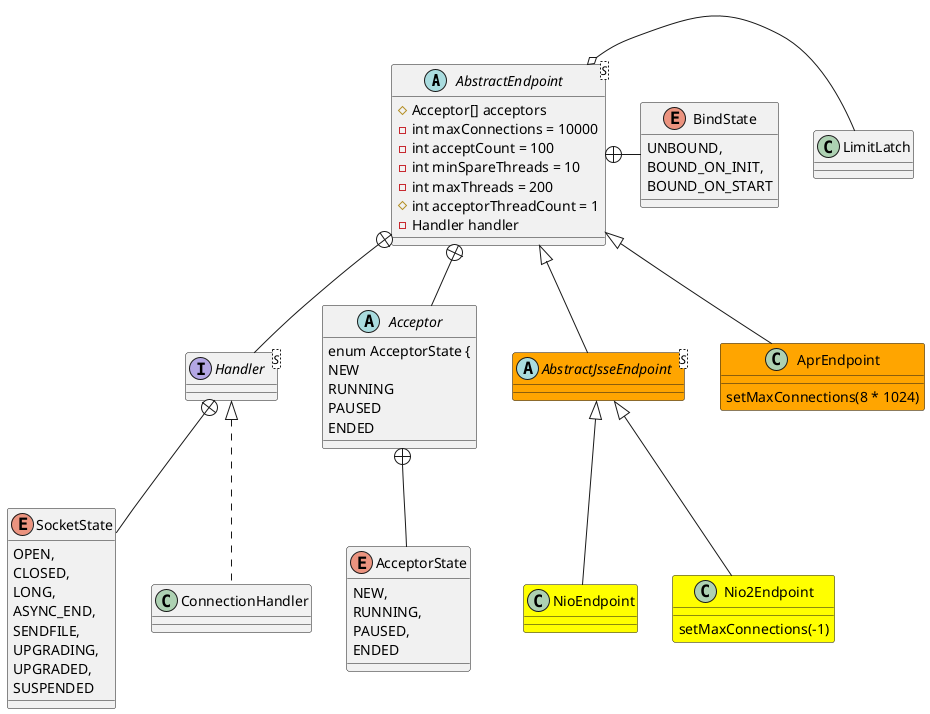

org.apache.tomcat.util.net.AbstractEndpoint
## tcp
TCP协议：端对端的、面向字节流、面向连接的、全双工可靠的传输层协议

## hierarchy
```
AbstractEndpoint (org.apache.tomcat.util.net)
    AbstractJsseEndpoint (org.apache.tomcat.util.net)
        NioEndpoint (org.apache.tomcat.util.net)
        Nio2Endpoint (org.apache.tomcat.util.net)
    AprEndpoint (org.apache.tomcat.util.net)
```

## define


## fields

```java
    protected int acceptorThreadCount = 1;
    private int maxConnections = 10000;
    private int acceptCount = 100;
    
    private int port;
    private InetAddress address;
    
    private int minSpareThreads = 10;
    private int maxThreads = 200;
```

## methods

### createExecutor()
```
public void createExecutor() {
    internalExecutor = true;
    TaskQueue taskqueue = new TaskQueue();
    TaskThreadFactory tf = new TaskThreadFactory(getName() + "-exec-", daemon, getThreadPriority());
    executor = new ThreadPoolExecutor(getMinSpareThreads(), getMaxThreads(), 60, TimeUnit.SECONDS,taskqueue, tf);
    taskqueue.setParent( (ThreadPoolExecutor) executor);
}
```

### TcpNoDelay
```java
    public boolean getTcpNoDelay() { return socketProperties.getTcpNoDelay();}
    public void setTcpNoDelay(boolean tcpNoDelay) { socketProperties.setTcpNoDelay(tcpNoDelay); }
```

### setMinSpareThreads
```java
    public void setMinSpareThreads(int minSpareThreads) {
        this.minSpareThreads = minSpareThreads;
        Executor executor = this.executor;
        if (internalExecutor && executor instanceof java.util.concurrent.ThreadPoolExecutor) {
            // The internal executor should always be an instance of
            // j.u.c.ThreadPoolExecutor but it may be null if the endpoint is
            // not running.
            // This check also avoids various threading issues.
            ((java.util.concurrent.ThreadPoolExecutor) executor).setCorePoolSize(minSpareThreads);
        }
    }
```

### setMaxThreads
```java
    public void setMaxThreads(int maxThreads) {
        this.maxThreads = maxThreads;
        Executor executor = this.executor;
        if (internalExecutor && executor instanceof java.util.concurrent.ThreadPoolExecutor) {
            // The internal executor should always be an instance of
            // j.u.c.ThreadPoolExecutor but it may be null if the endpoint is
            // not running.
            // This check also avoids various threading issues.
            ((java.util.concurrent.ThreadPoolExecutor) executor).setMaximumPoolSize(maxThreads);
        }
    }
```

### getCurrentThreadCount
```java
    public int getCurrentThreadCount() {
        Executor executor = this.executor;
        if (executor != null) {
            if (executor instanceof ThreadPoolExecutor) {
                return ((ThreadPoolExecutor) executor).getPoolSize();
            } else if (executor instanceof ResizableExecutor) {
                return ((ResizableExecutor) executor).getPoolSize();
            } else {
                return -1;
            }
        } else {
            return -2;
        }
    }
```

### createExecutor
```java
    public void createExecutor() {
        internalExecutor = true;
        TaskQueue taskqueue = new TaskQueue();
        TaskThreadFactory tf = new TaskThreadFactory(getName() + "-exec-", daemon, getThreadPriority());
        executor = new ThreadPoolExecutor(getMinSpareThreads(), getMaxThreads(), 60, TimeUnit.SECONDS,taskqueue, tf);
        taskqueue.setParent( (ThreadPoolExecutor) executor);
    }
```

### processSocket
```java
    public boolean processSocket(SocketWrapperBase<S> socketWrapper,
            SocketEvent event, boolean dispatch) {
        try {
            if (socketWrapper == null) {
                return false;
            }
            SocketProcessorBase<S> sc = processorCache.pop();
            if (sc == null) {
                sc = createSocketProcessor(socketWrapper, event);
            } else {
                sc.reset(socketWrapper, event);
            }
            Executor executor = getExecutor();
            if (dispatch && executor != null) {
                executor.execute(sc);
            } else {
                sc.run();
            }
        } catch (RejectedExecutionException ree) {
            getLog().warn(sm.getString("endpoint.executor.fail", socketWrapper) , ree);
            return false;
        } catch (Throwable t) {
            ExceptionUtils.handleThrowable(t);
            // This means we got an OOM or similar creating a thread, or that
            // the pool and its queue are full
            getLog().error(sm.getString("endpoint.process.fail"), t);
            return false;
        }
        return true;
    }
    
    protected abstract SocketProcessorBase<S> createSocketProcessor(
                SocketWrapperBase<S> socketWrapper, SocketEvent event);
```