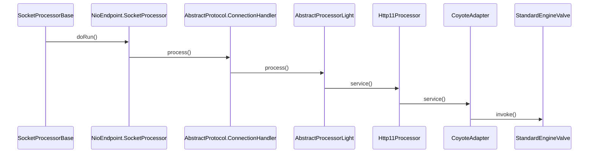
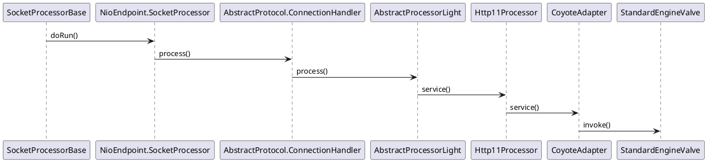

org.apache.tomcat.util.net.SocketProcessorBase

## hierarchy
```
SocketProcessorBase (org.apache.tomcat.util.net)
    SocketProcessor in AprEndpoint (org.apache.tomcat.util.net)
    SocketProcessor in Nio2Endpoint (org.apache.tomcat.util.net)
    SocketProcessor in NioEndpoint (org.apache.tomcat.util.net)
```

## define
```java
public abstract class SocketProcessorBase<S> implements Runnable {

    protected SocketWrapperBase<S> socketWrapper;
    protected SocketEvent event;

    public SocketProcessorBase(SocketWrapperBase<S> socketWrapper, SocketEvent event) {
        reset(socketWrapper, event);
    }


    public void reset(SocketWrapperBase<S> socketWrapper, SocketEvent event) {
        Objects.requireNonNull(event);
        this.socketWrapper = socketWrapper;
        this.event = event;
    }


    @Override
    public final void run() {
        synchronized (socketWrapper) {
            // It is possible that processing may be triggered for read and
            // write at the same time. The sync above makes sure that processing
            // does not occur in parallel. The test below ensures that if the
            // first event to be processed results in the socket being closed,
            // the subsequent events are not processed.
            if (socketWrapper.isClosed()) {
                return;
            }
            doRun();
        }
    }


    protected abstract void doRun();
}
```

## SocketProcessorBase.run()



## seq
