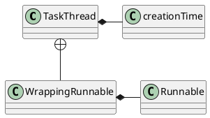
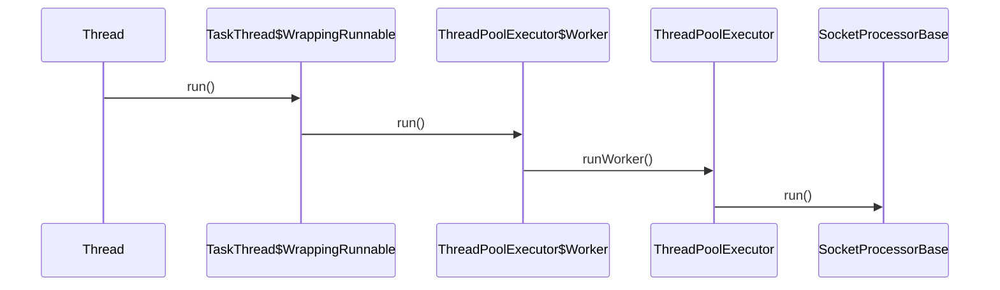

org.apache.tomcat.util.threads.TaskThread

## hierachical
```
Thread (java.lang)
    TaskThread (org.apache.tomcat.util.threads)
```
## define


```yuml
// {type:class}
[Runnable]^-.-[Thread]
[Thread]++-[Runnable]
[Thread]++-[ThreadGroup]


[Thread]^-[TaskThread]

[TaskThread]+->[WrappingRunnable]
[Runnable]^-.-[WrappingRunnable]
```

## thread.run() -> SocketProcessorBase.run()



[SocketProcessorBase](../net/SocketProcessorBase.md)