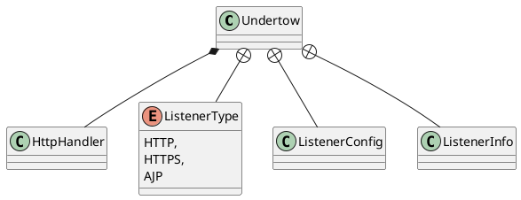

io.undertow.Undertow


## hierarchy
```

```

## define


## fields
```java
    private final int bufferSize;
    private final int ioThreads;
    private final int workerThreads;
    private final boolean directBuffers;
    private final List<ListenerConfig> listeners = new ArrayList<>();
    private volatile List<ListenerInfo> listenerInfo;
    private final HttpHandler rootHandler;
    private final OptionMap workerOptions;
    private final OptionMap socketOptions;
    private final OptionMap serverOptions;
    
    
    private final boolean internalWorker;

    private ByteBufferPool byteBufferPool;
    private XnioWorker worker;
    private List<AcceptingChannel<? extends StreamConnection>> channels;
    private Xnio xnio;
```

## methods

### construct
```java
    private Undertow(Builder builder) {
        this.byteBufferPool = builder.byteBufferPool;
        this.bufferSize = byteBufferPool != null ? byteBufferPool.getBufferSize() : builder.bufferSize;
        this.directBuffers = byteBufferPool != null ? byteBufferPool.isDirect() : builder.directBuffers;
        this.ioThreads = builder.ioThreads;
        this.workerThreads = builder.workerThreads;
        this.listeners.addAll(builder.listeners);
        this.rootHandler = builder.handler;
        this.worker = builder.worker;
        this.internalWorker = builder.worker == null;
        this.workerOptions = builder.workerOptions.getMap();
        this.socketOptions = builder.socketOptions.getMap();
        this.serverOptions = builder.serverOptions.getMap();
    }
```

### start
```java
    public synchronized void start() {
        UndertowLogger.ROOT_LOGGER.debugf("starting undertow server %s", this);
        xnio = Xnio.getInstance(Undertow.class.getClassLoader());
        channels = new ArrayList<>();
        try {
            if (internalWorker) {
                worker = xnio.createWorker(OptionMap.builder()
                        .set(Options.WORKER_IO_THREADS, ioThreads)
                        .set(Options.CONNECTION_HIGH_WATER, 1000000)
                        .set(Options.CONNECTION_LOW_WATER, 1000000)
                        .set(Options.WORKER_TASK_CORE_THREADS, workerThreads)
                        .set(Options.WORKER_TASK_MAX_THREADS, workerThreads)
                        .set(Options.TCP_NODELAY, true)
                        .set(Options.CORK, true)
                        .addAll(workerOptions)
                        .getMap());
            }

            OptionMap socketOptions = OptionMap.builder()
                    .set(Options.WORKER_IO_THREADS, worker.getIoThreadCount())
                    .set(Options.TCP_NODELAY, true)
                    .set(Options.REUSE_ADDRESSES, true)
                    .set(Options.BALANCING_TOKENS, 1)
                    .set(Options.BALANCING_CONNECTIONS, 2)
                    .set(Options.BACKLOG, 1000)
                    .addAll(this.socketOptions)
                    .getMap();

            OptionMap serverOptions = OptionMap.builder()
                    .set(UndertowOptions.NO_REQUEST_TIMEOUT, 60 * 1000)
                    .addAll(this.serverOptions)
                    .getMap();


            ByteBufferPool buffers = this.byteBufferPool;
            if (buffers == null) {
                buffers = new DefaultByteBufferPool(directBuffers, bufferSize, -1, 4);
            }

            listenerInfo = new ArrayList<>();
            for (ListenerConfig listener : listeners) {
                UndertowLogger.ROOT_LOGGER.debugf("Configuring listener with protocol %s for interface %s and port %s", listener.type, listener.host, listener.port);
                final HttpHandler rootHandler = listener.rootHandler != null ? listener.rootHandler : this.rootHandler;
                if (listener.type == ListenerType.AJP) {
                    AjpOpenListener openListener = new AjpOpenListener(buffers, serverOptions);
                    openListener.setRootHandler(rootHandler);

                    final ChannelListener<StreamConnection> finalListener;
                    if (listener.useProxyProtocol) {
                        finalListener = new ProxyProtocolOpenListener(openListener, null, buffers, OptionMap.EMPTY);
                    } else {
                        finalListener = openListener;
                    }
                    ChannelListener<AcceptingChannel<StreamConnection>> acceptListener = ChannelListeners.openListenerAdapter(finalListener);
                    OptionMap socketOptionsWithOverrides = OptionMap.builder().addAll(socketOptions).addAll(listener.overrideSocketOptions).getMap();
                    AcceptingChannel<? extends StreamConnection> server = worker.createStreamConnectionServer(new InetSocketAddress(Inet4Address.getByName(listener.host), listener.port), acceptListener, socketOptionsWithOverrides);
                    server.resumeAccepts();
                    channels.add(server);
                    listenerInfo.add(new ListenerInfo("ajp", server.getLocalAddress(), openListener, null, server));
                } else {
                    OptionMap undertowOptions = OptionMap.builder().set(UndertowOptions.BUFFER_PIPELINED_DATA, true).addAll(serverOptions).getMap();
                    boolean http2 = serverOptions.get(UndertowOptions.ENABLE_HTTP2, false);
                    if (listener.type == ListenerType.HTTP) {
                        HttpOpenListener openListener = new HttpOpenListener(buffers, undertowOptions);
                        HttpHandler handler = rootHandler;
                        if (http2) {
                            handler = new Http2UpgradeHandler(handler);
                        }
                        openListener.setRootHandler(handler);
                        final ChannelListener<StreamConnection> finalListener;
                        if (listener.useProxyProtocol) {
                            finalListener = new ProxyProtocolOpenListener(openListener, null, buffers, OptionMap.EMPTY);
                        } else {
                            finalListener = openListener;
                        }

                        ChannelListener<AcceptingChannel<StreamConnection>> acceptListener = ChannelListeners.openListenerAdapter(finalListener);
                        OptionMap socketOptionsWithOverrides = OptionMap.builder().addAll(socketOptions).addAll(listener.overrideSocketOptions).getMap();
                        AcceptingChannel<? extends StreamConnection> server = worker.createStreamConnectionServer(new InetSocketAddress(Inet4Address.getByName(listener.host), listener.port), acceptListener, socketOptionsWithOverrides);
                        server.resumeAccepts();
                        channels.add(server);
                        listenerInfo.add(new ListenerInfo("http", server.getLocalAddress(), openListener, null, server));
                    } else if (listener.type == ListenerType.HTTPS) {
                        OpenListener openListener;

                        HttpOpenListener httpOpenListener = new HttpOpenListener(buffers, undertowOptions);
                        httpOpenListener.setRootHandler(rootHandler);

                        if (http2) {
                            AlpnOpenListener alpn = new AlpnOpenListener(buffers, undertowOptions, httpOpenListener);
                            if (http2) {
                                Http2OpenListener http2Listener = new Http2OpenListener(buffers, undertowOptions);
                                http2Listener.setRootHandler(rootHandler);
                                alpn.addProtocol(Http2OpenListener.HTTP2, http2Listener, 10);
                                alpn.addProtocol(Http2OpenListener.HTTP2_14, http2Listener, 7);
                            }
                            openListener = alpn;
                        } else {
                            openListener = httpOpenListener;
                        }

                        UndertowXnioSsl xnioSsl;
                        if (listener.sslContext != null) {
                            xnioSsl = new UndertowXnioSsl(xnio, OptionMap.create(Options.USE_DIRECT_BUFFERS, true), listener.sslContext);
                        } else {
                            OptionMap.Builder builder = OptionMap.builder();
                            builder.addAll(listener.overrideSocketOptions);
                            if (!listener.overrideSocketOptions.contains(Options.SSL_PROTOCOL)) {
                                builder.set(Options.SSL_PROTOCOL, "TLSv1.2");
                            }
                            xnioSsl = new UndertowXnioSsl(xnio, OptionMap.create(Options.USE_DIRECT_BUFFERS, true), JsseSslUtils.createSSLContext(listener.keyManagers, listener.trustManagers, new SecureRandom(), builder.getMap()));
                        }

                        OptionMap socketOptionsWithOverrides = OptionMap.builder().addAll(socketOptions).addAll(listener.overrideSocketOptions).getMap();
                        AcceptingChannel<? extends StreamConnection> sslServer;
                        if (listener.useProxyProtocol) {
                            ChannelListener<AcceptingChannel<StreamConnection>> acceptListener = ChannelListeners.openListenerAdapter(new ProxyProtocolOpenListener(openListener, xnioSsl, buffers, socketOptionsWithOverrides));
                            sslServer = worker.createStreamConnectionServer(new InetSocketAddress(Inet4Address.getByName(listener.host), listener.port), (ChannelListener) acceptListener, socketOptionsWithOverrides);
                        } else {
                            ChannelListener<AcceptingChannel<StreamConnection>> acceptListener = ChannelListeners.openListenerAdapter(openListener);
                            sslServer = xnioSsl.createSslConnectionServer(worker, new InetSocketAddress(Inet4Address.getByName(listener.host), listener.port), (ChannelListener) acceptListener, socketOptionsWithOverrides);
                        }

                        sslServer.resumeAccepts();
                        channels.add(sslServer);
                        listenerInfo.add(new ListenerInfo("https", sslServer.getLocalAddress(), openListener, xnioSsl, sslServer));
                    }
                }

            }

        } catch (Exception e) {
            if(internalWorker && worker != null) {
                worker.shutdownNow();
            }
            throw new RuntimeException(e);
        }
    }
```

### stop
```java
    public synchronized void stop() {
        UndertowLogger.ROOT_LOGGER.debugf("stopping undertow server %s", this);
        if (channels != null) {
            for (AcceptingChannel<? extends StreamConnection> channel : channels) {
                IoUtils.safeClose(channel);
            }
            channels = null;
        }

        /*
         * Only shutdown the worker if it was created during start()
         */
        if (internalWorker && worker != null) {
            worker.shutdown();
            try {
                worker.awaitTermination();
            } catch (InterruptedException e) {
                throw new RuntimeException(e);
            }
            worker = null;
        }
        xnio = null;
        listenerInfo = null;
    }
```

## inner class

### Builder
```java
public static final class Builder {

        private int bufferSize;
        private int ioThreads;
        private int workerThreads;
        private boolean directBuffers;
        private final List<ListenerConfig> listeners = new ArrayList<>();
        private HttpHandler handler;
        private XnioWorker worker;
        private ByteBufferPool byteBufferPool;

        private final OptionMap.Builder workerOptions = OptionMap.builder();
        private final OptionMap.Builder socketOptions = OptionMap.builder();
        private final OptionMap.Builder serverOptions = OptionMap.builder();

        private Builder() {
            ioThreads = Math.max(Runtime.getRuntime().availableProcessors(), 2);
            workerThreads = ioThreads * 8;
            long maxMemory = Runtime.getRuntime().maxMemory();
            //smaller than 64mb of ram we use 512b buffers
            if (maxMemory < 64 * 1024 * 1024) {
                //use 512b buffers
                directBuffers = false;
                bufferSize = 512;
            } else if (maxMemory < 128 * 1024 * 1024) {
                //use 1k buffers
                directBuffers = true;
                bufferSize = 1024;
            } else {
                //use 16k buffers for best performance
                //as 16k is generally the max amount of data that can be sent in a single write() call
                directBuffers = true;
                bufferSize = 1024 * 16 - 20; //the 20 is to allow some space for protocol headers, see UNDERTOW-1209
            }

        }
}        
```