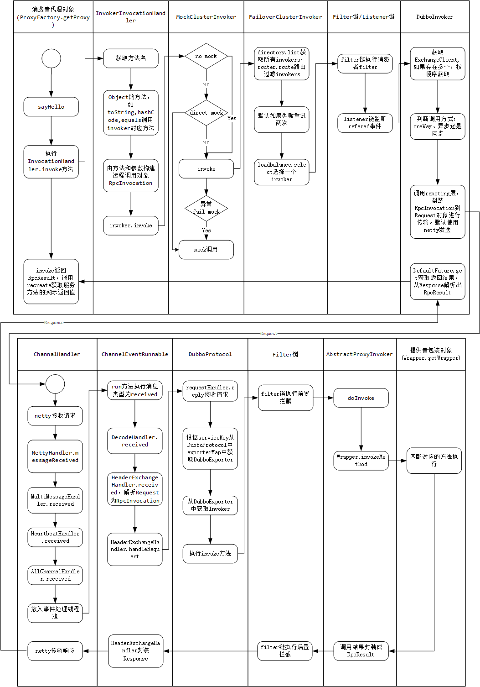
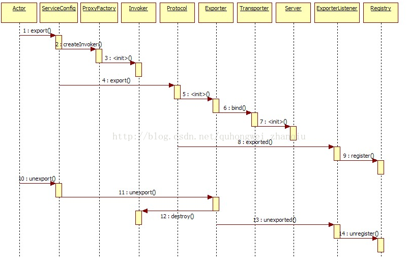
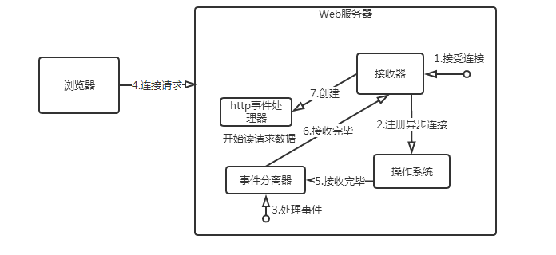

# View Image

this is generated files, just for view image conveniently...

## dubbo-architecture-00.png

## dubbo-architecture.png

## dubbo-consumer-invoke-provider.png

## dubbo-docs-cluster.jpg

## dubbo-docs-data-format.jpg

## dubbo-docs-request-id-application.jpg

## dubbo-docs-send-request-process.jpg

## dubbo-export.png

## dubbo-extensionloader.png

## dubbo-framework.jpg

## dubbo-idea-ReferenceBean.png

## dubbo-idea-ServiceBean.png

## dubbo-modules.jpg

## dubbo-proxy.jpg

## dubbo-refer.png

## dubbo-ReferenceBean.png

## dubbo-service-export-activity.png

## dubbo-service-export-sequence.png

## dubbo-service-refer-sequence.png

## dubbo-ServiceBean.jpg

## elk-architecture-01.png

## elk-architecture-02.png

## elk-architecture-03.png

## elk-logstash.png

## eventual.consistency.method.png

## hadoop1.x.jpg

## hdfs-mapreduce-hbase-zookeeper.jpg

## high-availability.png

## high-concurrency.png

## mongodb-app.png

## paxos-concept-info.jpg

## rocketmq-tx-message.png

## web-proactor.png

