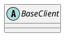

com.orbitz.consul.BaseClient

## ## hierarchy
```
BaseClient (com.orbitz.consul)
    AclClient (com.orbitz.consul)
    AgentClient (com.orbitz.consul)
    CatalogClient (com.orbitz.consul)
    CoordinateClient (com.orbitz.consul)
    EventClient (com.orbitz.consul)
    HealthClient (com.orbitz.consul)
    KeyValueClient (com.orbitz.consul)
    OperatorClient (com.orbitz.consul)
    PreparedQueryClient (com.orbitz.consul)
    SessionClient (com.orbitz.consul)
    SnapshotClient (com.orbitz.consul)
    StatusClient (com.orbitz.consul)
```

## define


## fields


## methods