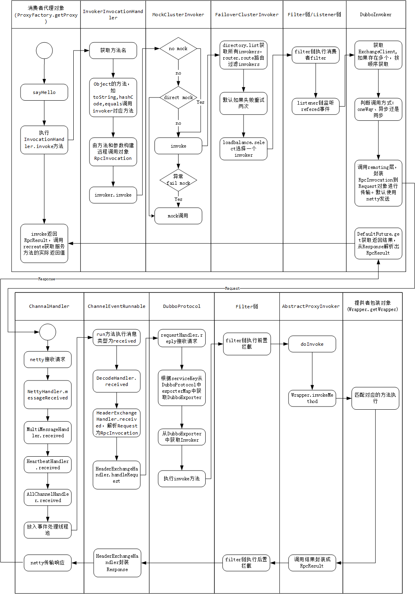
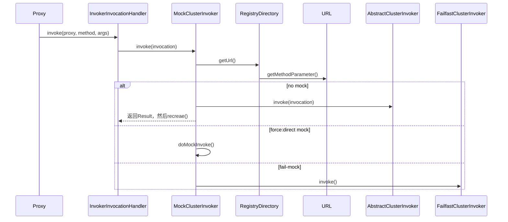
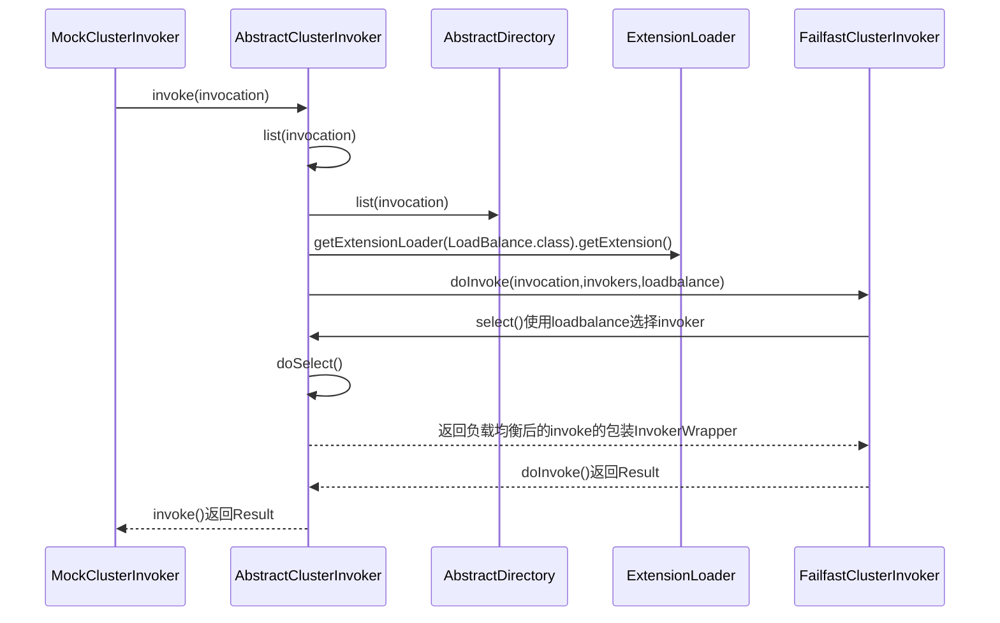
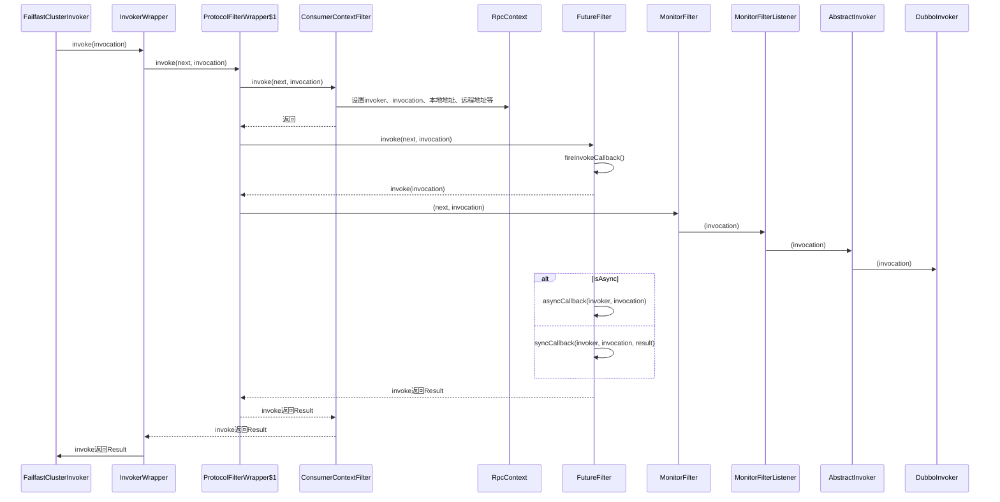
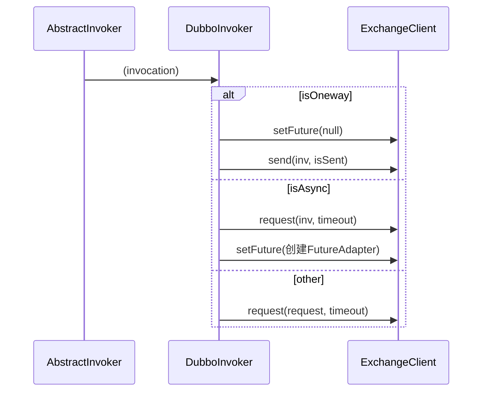

com.alibaba.dubbo.rpc.proxy.InvokerInvocationHandler实现jdk的调用处理器

## 调用过程
* 消费端
  * rpc 应用层协议
    - JavassitProxy 消费者动态代理对象 
    - InvokerInvocationHandler.invoke() 调用者处理器
    - MockClusterInvoker.invoke()  测试数据
    - `FailfastClusterInvoker.doInvoke()` 集群策略 **集群、路由、负载均衡**
    - Filter/Listener链 
      - ListenerInvokerWrapper.invoke()
      - ConsumerContextFilter -> FutureFilter -> MonitorFilter
    - `DubboInvoker.doInvoke()`
      - oneWay
      - async
      - sync ResponseFuture.get()
  * remoting 传输层协议
    - ExchangeClient
      - ReferenceCountExchangeClient.request() 
      - HeaderExchangeClient.request() 
      - HeaderExchangeChannel.request() 请求-响应模型
    - NettyClient
      - AbstractPeer.send()
      - AbstractClient.send()
      - NettyChannel.send()
      - NioClientSocketChannel.write()
* 服务端
  * Thread 线程模型
    - Thread.run()
    - ThreadPoolExecutor$Worker.run()
    - ThreadPoolExecutor.runWorker()
  * remoting 传输层协议
    - ChannelEventRunnable.run()
    - ChannelHandler 
      - DecodeHandler.received()
      - HeaderExchangeHandler.received(), handleRequest()  请求-响应模型
  * rpc 应用层协议
    - DubboProtocol
    - Filter链 
      - ProtocolFilterWrapper$1.invoke()
      - EchoFilter -> ClassLoaderFilter -> GenericFilter -> ContextFilter -> TraceFilter -> MonitorFilter -> TimeoutFilter -> ExceptionFilter
    - InvokerWrapper.invoke()
      - AbstractProxyInvoker.invoke()
    - JavassistProxyFactory$1.doInvoke() 
      - Wrapper46.invokeMethod() 生成的JavassitProxy动态代理

## invoke时序

## 1. client side invoke

### 1.1 集群、路由、负载均衡 cluster-router-loadbalance

### 1.2 protocol

### 1.3 dubbo-invoker 交换层、传输层

