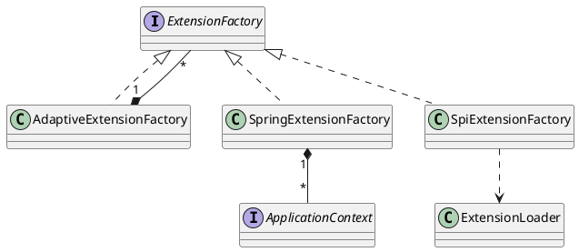

com.alibaba.dubbo.common.extension.ExtensionFactory
## hierachy
```
ExtensionFactory (com.alibaba.dubbo.common.extension)
    SpringExtensionFactory (com.alibaba.dubbo.config.spring.extension)
    AdaptiveExtensionFactory (com.alibaba.dubbo.common.extension.factory)
    SpiExtensionFactory (com.alibaba.dubbo.common.extension.factory)
```
## define


```java
@SPI
public interface ExtensionFactory {
    <T> T getExtension(Class<T> type, String name);
}

public class SpiExtensionFactory implements ExtensionFactory {
    public <T> T getExtension(Class<T> type, String name) {
        if (type.isInterface() && type.isAnnotationPresent(SPI.class)) {
            ExtensionLoader<T> loader = ExtensionLoader.getExtensionLoader(type);
            if (loader.getSupportedExtensions().size() > 0) {
                return loader.getAdaptiveExtension();
            }
        }
        return null;
    }
}

```