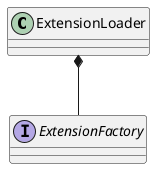
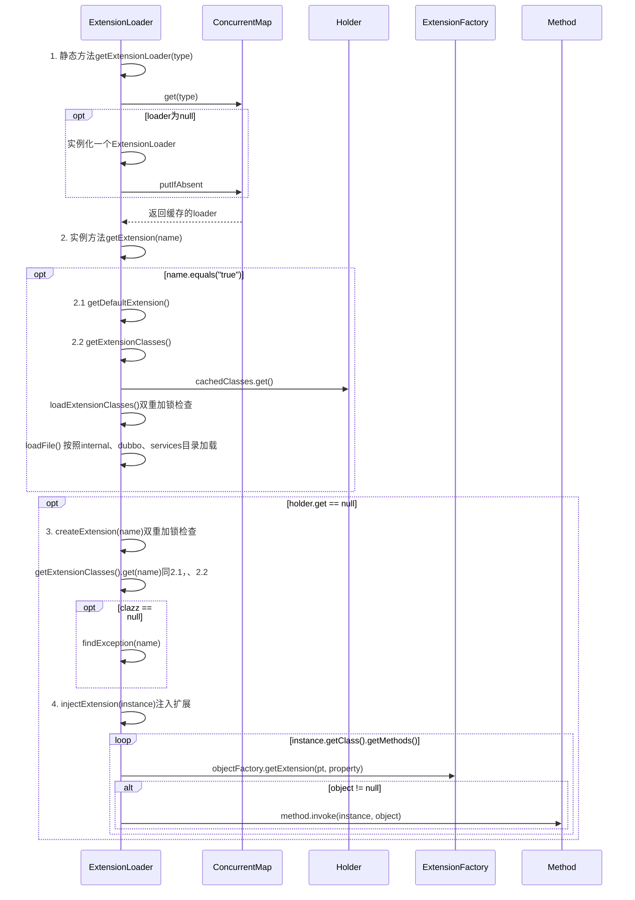

com.alibaba.dubbo.common.extension.ExtensionLoader

## define
使用ConcurrentMap容器，用作缓存



## fields

### static
```java
    private static final String SERVICES_DIRECTORY = "META-INF/services/";
    private static final String DUBBO_DIRECTORY = "META-INF/dubbo/";
    private static final String DUBBO_INTERNAL_DIRECTORY = DUBBO_DIRECTORY + "internal/";
    private static final Pattern NAME_SEPARATOR = Pattern.compile("\\s*[,]+\\s*");
    private static final ConcurrentMap<Class<?>, ExtensionLoader<?>> EXTENSION_LOADERS = new ConcurrentHashMap<Class<?>, ExtensionLoader<?>>();
    private static final ConcurrentMap<Class<?>, Object> EXTENSION_INSTANCES = new ConcurrentHashMap<Class<?>, Object>();
```
### instance
```java
    private final Class<?> type;
    private final ExtensionFactory objectFactory;
    private final ConcurrentMap<Class<?>, String> cachedNames = new ConcurrentHashMap<Class<?>, String>();
    private final Holder<Map<String, Class<?>>> cachedClasses = new Holder<Map<String, Class<?>>>();
    private final Map<String, Activate> cachedActivates = new ConcurrentHashMap<String, Activate>();
    private final ConcurrentMap<String, Holder<Object>> cachedInstances = new ConcurrentHashMap<String, Holder<Object>>();
    private final Holder<Object> cachedAdaptiveInstance = new Holder<Object>();
    private volatile Class<?> cachedAdaptiveClass = null;
    private String cachedDefaultName;
    private volatile Throwable createAdaptiveInstanceError;
    private Set<Class<?>> cachedWrapperClasses;
    private Map<String, IllegalStateException> exceptions = new ConcurrentHashMap<String, IllegalStateException>();
```

## methods

### getExtensionLoader
```java
    public static <T> ExtensionLoader<T> getExtensionLoader(Class<T> type) {
        if (type == null)
            throw new IllegalArgumentException("Extension type == null");
        if (!type.isInterface()) {
            throw new IllegalArgumentException("Extension type(" + type + ") is not interface!");
        }
        if (!withExtensionAnnotation(type)) {
            throw new IllegalArgumentException("Extension type(" + type +
                    ") is not extension, because WITHOUT @" + SPI.class.getSimpleName() + " Annotation!");
        }

        ExtensionLoader<T> loader = (ExtensionLoader<T>) EXTENSION_LOADERS.get(type);
        if (loader == null) {
            EXTENSION_LOADERS.putIfAbsent(type, new ExtensionLoader<T>(type));
            loader = (ExtensionLoader<T>) EXTENSION_LOADERS.get(type);
        }
        return loader;
    }
```

### getAdaptiveExtension
```java
    public T getAdaptiveExtension() {
        Object instance = cachedAdaptiveInstance.get();
        if (instance == null) {
            if (createAdaptiveInstanceError == null) {
                synchronized (cachedAdaptiveInstance) {
                    instance = cachedAdaptiveInstance.get();
                    if (instance == null) {
                        try {
                            instance = createAdaptiveExtension();
                            cachedAdaptiveInstance.set(instance);
                        } catch (Throwable t) {
                            createAdaptiveInstanceError = t;
                            throw new IllegalStateException("fail to create adaptive instance: " + t.toString(), t);
                        }
                    }
                }
            } else {
                throw new IllegalStateException("fail to create adaptive instance: " + createAdaptiveInstanceError.toString(), createAdaptiveInstanceError);
            }
        }

        return (T) instance;
    }
    
    private T createAdaptiveExtension() {
        try {
            return injectExtension((T) getAdaptiveExtensionClass().newInstance());
        } catch (Exception e) {
            throw new IllegalStateException("Can not create adaptive extenstion " + type + ", cause: " + e.getMessage(), e);
        }
    }    
    
    private Class<?> getAdaptiveExtensionClass() {
        getExtensionClasses();
        if (cachedAdaptiveClass != null) {
            return cachedAdaptiveClass;
        }
        return cachedAdaptiveClass = createAdaptiveExtensionClass();
    }
    
    private Class<?> createAdaptiveExtensionClass() {
        String code = createAdaptiveExtensionClassCode();
        ClassLoader classLoader = findClassLoader();
        com.alibaba.dubbo.common.compiler.Compiler compiler = ExtensionLoader.getExtensionLoader(com.alibaba.dubbo.common.compiler.Compiler.class).getAdaptiveExtension();
        return compiler.compile(code, classLoader);
    }    
```

### getExtension
```java
    public T getExtension(String name) {
        if (name == null || name.length() == 0)
            throw new IllegalArgumentException("Extension name == null");
        if ("true".equals(name)) {
            return getDefaultExtension();
        }
        Holder<Object> holder = cachedInstances.get(name);
        if (holder == null) {
            cachedInstances.putIfAbsent(name, new Holder<Object>());
            holder = cachedInstances.get(name);
        }
        Object instance = holder.get();
        if (instance == null) {
            synchronized (holder) {
                instance = holder.get();
                if (instance == null) {
                    instance = createExtension(name);
                    holder.set(instance);
                }
            }
        }
        return (T) instance;
    }
```



### createExtension
```java
    private T createExtension(String name) {
        Class<?> clazz = getExtensionClasses().get(name);
        if (clazz == null) {
            throw findException(name);
        }
        try {
            T instance = (T) EXTENSION_INSTANCES.get(clazz);
            if (instance == null) {
                EXTENSION_INSTANCES.putIfAbsent(clazz, (T) clazz.newInstance());
                instance = (T) EXTENSION_INSTANCES.get(clazz);
            }
            injectExtension(instance);
            Set<Class<?>> wrapperClasses = cachedWrapperClasses;
            if (wrapperClasses != null && wrapperClasses.size() > 0) {
                for (Class<?> wrapperClass : wrapperClasses) {
                    instance = injectExtension((T) wrapperClass.getConstructor(type).newInstance(instance));
                }
            }
            return instance;
        } catch (Throwable t) {
            throw new IllegalStateException("Extension instance(name: " + name + ", class: " +
                    type + ")  could not be instantiated: " + t.getMessage(), t);
        }
    }
```

### injectExtension
```java
    private T injectExtension(T instance) {
        try {
            if (objectFactory != null) {
                for (Method method : instance.getClass().getMethods()) {
                    if (method.getName().startsWith("set")
                            && method.getParameterTypes().length == 1
                            && Modifier.isPublic(method.getModifiers())) {
                        Class<?> pt = method.getParameterTypes()[0];
                        try {
                            String property = method.getName().length() > 3 ? method.getName().substring(3, 4).toLowerCase() + method.getName().substring(4) : "";
                            Object object = objectFactory.getExtension(pt, property);
                            if (object != null) {
                                method.invoke(instance, object);
                            }
                        } catch (Exception e) {
                            logger.error("fail to inject via method " + method.getName()
                                    + " of interface " + type.getName() + ": " + e.getMessage(), e);
                        }
                    }
                }
            }
        } catch (Exception e) {
            logger.error(e.getMessage(), e);
        }
        return instance;
    }
```


### getExtensionClasses
```java
    private Map<String, Class<?>> getExtensionClasses() {
        Map<String, Class<?>> classes = cachedClasses.get();
        if (classes == null) {
            synchronized (cachedClasses) {
                classes = cachedClasses.get();
                if (classes == null) {
                    classes = loadExtensionClasses();
                    cachedClasses.set(classes);
                }
            }
        }
        return classes;
    }
```

### loadExtensionClasses
- 加载 META-INF/dubbo/internal/
- 加载 META-INF/dubbo/
- 加载 META-INF/services/

```java
    // 此方法已经getExtensionClasses方法同步过。
    private Map<String, Class<?>> loadExtensionClasses() {
        final SPI defaultAnnotation = type.getAnnotation(SPI.class);
        if (defaultAnnotation != null) {
            String value = defaultAnnotation.value();
            if (value != null && (value = value.trim()).length() > 0) {
                String[] names = NAME_SEPARATOR.split(value);
                if (names.length > 1) {
                    throw new IllegalStateException("more than 1 default extension name on extension " + type.getName()
                            + ": " + Arrays.toString(names));
                }
                if (names.length == 1) cachedDefaultName = names[0];
            }
        }

        Map<String, Class<?>> extensionClasses = new HashMap<String, Class<?>>();
        loadFile(extensionClasses, DUBBO_INTERNAL_DIRECTORY); 
        loadFile(extensionClasses, DUBBO_DIRECTORY);
        loadFile(extensionClasses, SERVICES_DIRECTORY);
        return extensionClasses;
    }
```
