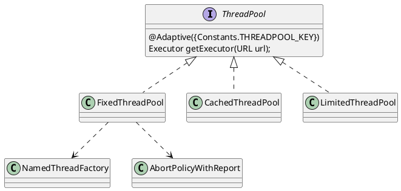

com.alibaba.dubbo.common.threadpool
## package
```
support
    cached
        CachedThreadPool
    fixed
        FixedThreadPool
    limited
        LimitedThreadPool
    AbortPolicyWithReport
ThreadPool
```

## ThreadPool
```
ThreadPool (com.alibaba.dubbo.common.threadpool)
    FixedThreadPool (com.alibaba.dubbo.common.threadpool.support.fixed)
    CachedThreadPool (com.alibaba.dubbo.common.threadpool.support.cached)
    LimitedThreadPool (com.alibaba.dubbo.common.threadpool.support.limited)
```

### define


## FixedThreadPool
```

getExecutor:40, FixedThreadPool (com.alibaba.dubbo.common.threadpool.support.fixed)
getExecutor:-1, ThreadPool$Adpative (com.alibaba.dubbo.common.threadpool)
<init>:49, WrappedChannelHandler (com.alibaba.dubbo.remoting.transport.dispatcher)
<init>:32, AllChannelHandler (com.alibaba.dubbo.remoting.transport.dispatcher.all)

dispatch:32, AllDispatcher (com.alibaba.dubbo.remoting.transport.dispatcher.all)
dispatch:-1, Dispatcher$Adpative (com.alibaba.dubbo.remoting)
wrapInternal:49, ChannelHandlers (com.alibaba.dubbo.remoting.transport.dispatcher)
wrap:37, ChannelHandlers (com.alibaba.dubbo.remoting.transport.dispatcher)

<init>:63, NettyServer (com.alibaba.dubbo.remoting.transport.netty)
bind:33, NettyTransporter (com.alibaba.dubbo.remoting.transport.netty)
bind:-1, Transporter$Adpative (com.alibaba.dubbo.remoting)
bind:57, Transporters (com.alibaba.dubbo.remoting)
bind:41, HeaderExchanger (com.alibaba.dubbo.remoting.exchange.support.header)
bind:71, Exchangers (com.alibaba.dubbo.remoting.exchange)
createServer:279, DubboProtocol (com.alibaba.dubbo.rpc.protocol.dubbo)
openServer:258, DubboProtocol (com.alibaba.dubbo.rpc.protocol.dubbo)

export:245, DubboProtocol (com.alibaba.dubbo.rpc.protocol.dubbo)
export:56, ProtocolListenerWrapper (com.alibaba.dubbo.rpc.protocol)
export:94, ProtocolFilterWrapper (com.alibaba.dubbo.rpc.protocol)
export:-1, Protocol$Adpative (com.alibaba.dubbo.rpc)

doLocalExport:163, RegistryProtocol (com.alibaba.dubbo.registry.integration)
export:116, RegistryProtocol (com.alibaba.dubbo.registry.integration)
export:54, ProtocolListenerWrapper (com.alibaba.dubbo.rpc.protocol)
export:92, ProtocolFilterWrapper (com.alibaba.dubbo.rpc.protocol)
export:-1, Protocol$Adpative (com.alibaba.dubbo.rpc)

doExportUrlsFor1Protocol:550, ServiceConfig (com.alibaba.dubbo.config)
doExportUrls:346, ServiceConfig (com.alibaba.dubbo.config)
doExport:307, ServiceConfig (com.alibaba.dubbo.config)
export:206, ServiceConfig (com.alibaba.dubbo.config)
onApplicationEvent:109, ServiceBean (com.alibaba.dubbo.config.spring)

// 事件监听
doInvokeListener:172, SimpleApplicationEventMulticaster (org.springframework.context.event)
invokeListener:165, SimpleApplicationEventMulticaster (org.springframework.context.event)
multicastEvent:139, SimpleApplicationEventMulticaster (org.springframework.context.event)
publishEvent:393, AbstractApplicationContext (org.springframework.context.support)
publishEvent:347, AbstractApplicationContext (org.springframework.context.support)
finishRefresh:883, AbstractApplicationContext (org.springframework.context.support)
finishRefresh:144, EmbeddedWebApplicationContext (org.springframework.boot.context.embedded)
refresh:546, AbstractApplicationContext (org.springframework.context.support)
refresh:122, EmbeddedWebApplicationContext (org.springframework.boot.context.embedded)
refresh:693, SpringApplication (org.springframework.boot)
refreshContext:360, SpringApplication (org.springframework.boot)
run:303, SpringApplication (org.springframework.boot)
run:1118, SpringApplication (org.springframework.boot)
run:1107, SpringApplication (org.springframework.boot)
main:17, Application (com.test.onion.test)
```