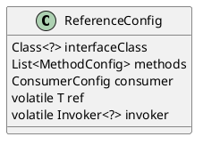

com.alibaba.dubbo.config.ReferenceConfig
## hierarchy
```
AbstractConfig (com.alibaba.dubbo.config)
    AbstractMethodConfig (com.alibaba.dubbo.config)
        AbstractInterfaceConfig (com.alibaba.dubbo.config)
            AbstractReferenceConfig (com.alibaba.dubbo.config)
                ReferenceConfig (com.alibaba.dubbo.config)
                    ReferenceBean (com.alibaba.dubbo.config.spring)
```
## define


```java
public class ReferenceConfig<T> extends AbstractReferenceConfig {
    private static final long serialVersionUID = -5864351140409987595L;
    private static final Protocol refprotocol = ExtensionLoader.getExtensionLoader(Protocol.class).getAdaptiveExtension();
    private static final Cluster cluster = ExtensionLoader.getExtensionLoader(Cluster.class).getAdaptiveExtension();
    private static final ProxyFactory proxyFactory = ExtensionLoader.getExtensionLoader(ProxyFactory.class).getAdaptiveExtension();
    private final List<URL> urls = new ArrayList<URL>();
    private String interfaceName; // 接口类型
    private Class<?> interfaceClass;
    private String client; // 客户端类型
    private String url; // 点对点直连服务提供地址
    private List<MethodConfig> methods; // 方法配置
    private ConsumerConfig consumer; // 缺省配置
    private String protocol;
    private transient volatile T ref; // 接口代理类引用
    private transient volatile Invoker<?> invoker;
    private transient volatile boolean initialized;
    private transient volatile boolean destroyed;
}    
```

## methods

### get
```java
    public synchronized T get() {
        if (destroyed) {
            throw new IllegalStateException("Already destroyed!");
        }
        if (ref == null) {
            init();
        }
        return ref;
    }
```

### init
```java
    private void init() {
        if (initialized) {
            return;
        }
        // 获取消费者全局配置
        checkDefault();    
        checkApplication();
        checkStubAndMock(interfaceClass);
        
        ref = createProxy(map);
    }    
```

### createProxy
```java
    private T createProxy(Map<String, String> map) {
        if (isJvmRefer) {
            URL url = new URL(Constants.LOCAL_PROTOCOL, NetUtils.LOCALHOST, 0, interfaceClass.getName()).addParameters(map);
            invoker = refprotocol.refer(interfaceClass, url);
        } else {
            if (urls.size() == 1) {
                invoker = refprotocol.refer(interfaceClass, urls.get(0));
            } else {
                List<Invoker<?>> invokers = new ArrayList<Invoker<?>>();
                URL registryURL = null;
                for (URL url : urls) {
                    invokers.add(refprotocol.refer(interfaceClass, url));
                    if (Constants.REGISTRY_PROTOCOL.equals(url.getProtocol())) {
                        registryURL = url; // 用了最后一个registry url
                    }
                }
                if (registryURL != null) { // 有 注册中心协议的URL
                    // 对有注册中心的Cluster 只用 AvailableCluster
                    URL u = registryURL.addParameter(Constants.CLUSTER_KEY, AvailableCluster.NAME);
                    invoker = cluster.join(new StaticDirectory(u, invokers));
                } else { // 不是 注册中心的URL
                    invoker = cluster.join(new StaticDirectory(invokers));
                }
            }
        }
        // 创建服务代理
        return (T) proxyFactory.getProxy(invoker);
    }
```

## links
- [AbstractProxyFactory](/docs/30-distributed/src/dubbo/rpc/proxy/AbstractProxyFactory.md)
- [DubboProtocol](/docs/30-distributed/src/dubbo/rpc/protocol/dubbo/DubboProtocol.md)