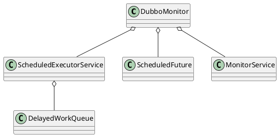

com.alibaba.dubbo.monitor.dubbo.DubboMonitor

## hierarchy
## define


## fields
* ScheduledExecutorService
* ConcurrentMap<Statistics, AtomicReference<long[]>>

```
// 定时任务执行器 3个线程
private final ScheduledExecutorService scheduledExecutorService = Executors.newScheduledThreadPool(3, new NamedThreadFactory("DubboMonitorSendTimer", true));
    
// 原子引用
private final ConcurrentMap<Statistics, AtomicReference<long[]>> statisticsMap = new ConcurrentHashMap<Statistics, AtomicReference<long[]>>();
```