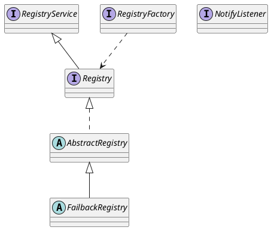

com.alibaba.dubbo.registry

* 发布订阅 自动发现、自动注册、变化更新

## package
```
dubbo
    DubboRegistry
    DubboRegistryFactory
integration
    RegistryDirectory
    RegistryProtocol
multicast
    MulticastRegistry
    MulticastRegistryFactory
pages
    RegisteredPageHandler
    RegistriesPageHandler
    SubscribedPageHandler
redis
    RedisRegistry
    RedisRegistryFactory
status
    RegistryStatusChecker
support
    AbstractRegistry
    AbstractRegistryFactory
    FailbackRegistry
    SkipFailbackWrapperException
zookeeper
    ZookeeperRegistry
    ZookeeperRegistryFactory
NotifyListener
Registry
RegistryFactory
RegistryService
```

## overview


## 类图
```yuml
// {type:class}

[RegistryService||+register(url);+unregister(url);+subscribe(url);+unsubscribe(url);+lookup(url)]

// 1. 网络节点
[Node]^-[Registry]
[RegistryService]^-[Registry]

// 2. 注册中心
[Registry]^-.-[AbstractRegistry]
[AbstractRegistry]^-[FailbackRegistry]

// 四种注册中心实现
[FailbackRegistry]^-[DubboRegistry]
[FailbackRegistry]^-[RedisRegistry]
[FailbackRegistry]^-[MulticastRegistry]
[FailbackRegistry]^-[ZookeeperRegistry]

// 3. 注册工厂
[RegistryFactory]^-.-[AbstractRegistryFactory||#createRegistry(url)]
[AbstractRegistryFactory]^-[MulticastRegistryFactory]
[AbstractRegistryFactory]^-[DubboRegistryFactory{bg:wheat}]
[AbstractRegistryFactory]^-[ZookeeperRegistryFactory]

[RegistryFactory]^-.-[RedisRegistryFactory]

// 依赖关系
[RegistryFactory]uses->[Registry]
[ZookeeperRegistryFactory]uses->[ZookeeperRegistry]
[DubboRegistryFactory]uses->[DubboRegistry]
[MulticastRegistryFactory]uses->[MulticastRegistry]

[RedisRegistryFactory]uses->[RedisRegistry]

```
