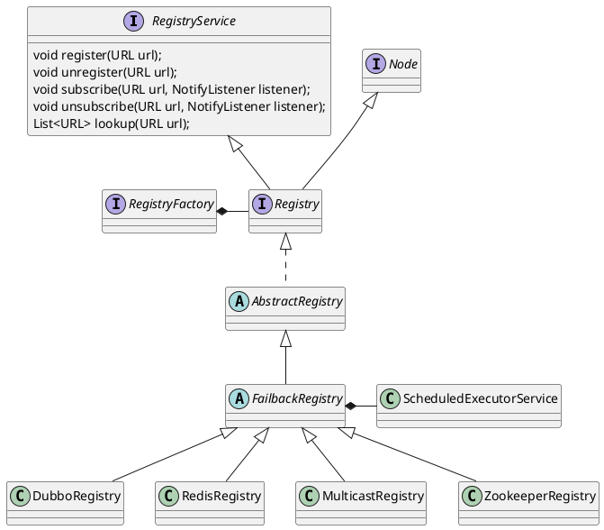

com.alibaba.dubbo.registry.RegistryService
## hierachy
```
RegistryService (com.alibaba.dubbo.registry)
    Registry (com.alibaba.dubbo.registry)
        AbstractRegistry (com.alibaba.dubbo.registry.support)
            FailbackRegistry (com.alibaba.dubbo.registry.support)
                DubboRegistry (com.alibaba.dubbo.registry.dubbo)
                RedisRegistry (com.alibaba.dubbo.registry.redis)
                MulticastRegistry (com.alibaba.dubbo.registry.multicast)
                ZookeeperRegistry (com.alibaba.dubbo.registry.zookeeper)
```

## define


## duty(function)
* 注册url
* 取消注册url
* 订阅url, listener
* 取消订阅
* 查找