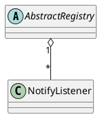

com.alibaba.dubbo.registry.support.AbstractRegistry

* ExecutorService
* AtomicLong AtomicBoolean AtomicReference
* ConcurrentHashMap
* ConcurrentHashSet

## hierarchy
```
AbstractRegistry (com.alibaba.dubbo.registry.support)
    FailbackRegistry (com.alibaba.dubbo.registry.support)
        DubboRegistry (com.alibaba.dubbo.registry.dubbo)
        MulticastRegistry (com.alibaba.dubbo.registry.multicast)
        RedisRegistry (com.alibaba.dubbo.registry.redis)
        ZookeeperRegistry (com.alibaba.dubbo.registry.zookeeper)
AbstractRegistry (com.alibaba.dubbo.registry.support)
    Object (java.lang)
    Registry (com.alibaba.dubbo.registry)
        Node (com.alibaba.dubbo.common)
        RegistryService (com.alibaba.dubbo.registry)
```

## define
