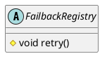

com.alibaba.dubbo.registry.support.FailbackRegistry

* ScheduledExecutorService 
* ScheduledFuture
* ConcurrentHashSet
* ConcurrentHashMap
* 模板方法模式

## hierarchy
```
AbstractRegistry (com.alibaba.dubbo.registry.support)
    FailbackRegistry (com.alibaba.dubbo.registry.support)
        DubboRegistry (com.alibaba.dubbo.registry.dubbo)
        MulticastRegistry (com.alibaba.dubbo.registry.multicast)
        RedisRegistry (com.alibaba.dubbo.registry.redis)
        ZookeeperRegistry (com.alibaba.dubbo.registry.zookeeper)
```

## define
* 失败重试



## fields
```java
    // 定时任务执行器
    private final ScheduledExecutorService retryExecutor = Executors.newScheduledThreadPool(1, new NamedThreadFactory("DubboRegistryFailedRetryTimer", true));

    // 失败重试定时器，定时检查是否有请求失败，如有，无限次重试
    private final ScheduledFuture<?> retryFuture;

    private final Set<URL> failedRegistered = new ConcurrentHashSet<URL>();

    private final Set<URL> failedUnregistered = new ConcurrentHashSet<URL>();

    private final ConcurrentMap<URL, Set<NotifyListener>> failedSubscribed = new ConcurrentHashMap<URL, Set<NotifyListener>>();

    private final ConcurrentMap<URL, Set<NotifyListener>> failedUnsubscribed = new ConcurrentHashMap<URL, Set<NotifyListener>>();

    private final ConcurrentMap<URL, Map<NotifyListener, List<URL>>> failedNotified = new ConcurrentHashMap<URL, Map<NotifyListener, List<URL>>>();

    private AtomicBoolean destroyed = new AtomicBoolean(false);
```

## methods

### FailbackRegistry
```java
    public FailbackRegistry(URL url) {
        super(url);
        int retryPeriod = url.getParameter(Constants.REGISTRY_RETRY_PERIOD_KEY, Constants.DEFAULT_REGISTRY_RETRY_PERIOD);
        this.retryFuture = retryExecutor.scheduleWithFixedDelay(new Runnable() {
            public void run() {
                // 检测并连接注册中心
                try {
                    retry();
                } catch (Throwable t) { // 防御性容错
                    logger.error("Unexpected error occur at failed retry, cause: " + t.getMessage(), t);
                }
            }
        }, retryPeriod, retryPeriod, TimeUnit.MILLISECONDS);
    }
```

### register
```java
    @Override
    public void register(URL url) {
        if (destroyed.get()){
            return;
        }
        super.register(url);
        failedRegistered.remove(url);
        failedUnregistered.remove(url);
        try {
            // 向服务器端发送注册请求
            doRegister(url);
        } catch (Exception e) {
            Throwable t = e;

            // 如果开启了启动时检测，则直接抛出异常
            boolean check = getUrl().getParameter(Constants.CHECK_KEY, true)
                    && url.getParameter(Constants.CHECK_KEY, true)
                    && !Constants.CONSUMER_PROTOCOL.equals(url.getProtocol());
            boolean skipFailback = t instanceof SkipFailbackWrapperException;
            if (check || skipFailback) {
                if (skipFailback) {
                    t = t.getCause();
                }
                throw new IllegalStateException("Failed to register " + url + " to registry " + getUrl().getAddress() + ", cause: " + t.getMessage(), t);
            } else {
                logger.error("Failed to register " + url + ", waiting for retry, cause: " + t.getMessage(), t);
            }

            // 将失败的注册请求记录到失败列表，定时重试
            failedRegistered.add(url);
        }
    }
```

### 模板方法模式
```java
    // ==== 模板方法 ====

    protected abstract void doRegister(URL url);

    protected abstract void doUnregister(URL url);

    protected abstract void doSubscribe(URL url, NotifyListener listener);

    protected abstract void doUnsubscribe(URL url, NotifyListener listener);
```

## links
scheduleWithFixedDelay 比如当前一个任务结束的时刻，开始结算间隔时间，如0秒开始执行第一次任务，任务耗时5秒，任务间隔时间3秒，那么第二次任务执行的时间是在第8秒开始。