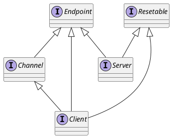

com.alibaba.dubbo.remoting.Endpoint

## hierarchy
```
Endpoint (com.alibaba.dubbo.remoting)
    AbstractPeer (com.alibaba.dubbo.remoting.transport)                         点对点抽象
        AbstractChannel (com.alibaba.dubbo.remoting.transport)
            GrizzlyChannel (com.alibaba.dubbo.remoting.transport.grizzly)
            MinaChannel (com.alibaba.dubbo.remoting.transport.mina)
            NettyChannel (com.alibaba.dubbo.remoting.transport.netty)
        AbstractEndpoint (com.alibaba.dubbo.remoting.transport)
            AbstractClient (com.alibaba.dubbo.remoting.transport)
                GrizzlyClient (com.alibaba.dubbo.remoting.transport.grizzly)
                MinaClient (com.alibaba.dubbo.remoting.transport.mina)
                NettyClient (com.alibaba.dubbo.remoting.transport.netty)
            AbstractServer (com.alibaba.dubbo.remoting.transport)
                GrizzlyServer (com.alibaba.dubbo.remoting.transport.grizzly)
                MinaServer (com.alibaba.dubbo.remoting.transport.mina)
                NettyServer (com.alibaba.dubbo.remoting.transport.netty)
    Channel (com.alibaba.dubbo.remoting)
        ExchangeChannel (com.alibaba.dubbo.remoting.exchange)
        Client (com.alibaba.dubbo.remoting)
    Client (com.alibaba.dubbo.remoting)
        ExchangeClient (com.alibaba.dubbo.remoting.exchange)
        ClientDelegate (com.alibaba.dubbo.remoting.transport)
        AbstractClient (com.alibaba.dubbo.remoting.transport)
    Server (com.alibaba.dubbo.remoting)
        Peer (com.alibaba.dubbo.remoting.p2p)
        ExchangeServer (com.alibaba.dubbo.remoting.exchange)
```
## define


```java
public interface Endpoint {
    URL getUrl();
    ChannelHandler getChannelHandler();
    InetSocketAddress getLocalAddress();
    void send(Object message) throws RemotingException;
    void send(Object message, boolean sent) throws RemotingException;
    void close();
    void close(int timeout);
    void startClose();
    boolean isClosed();
}
```