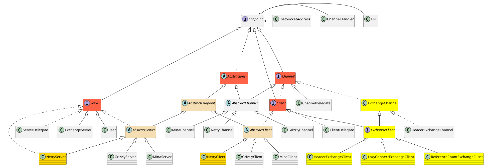

com.alibaba.dubbo.remoting

## remoting
TCP协议
* 交换层
* 端对端的抽象
* 传输层网络协议
* 对等网络连接方式
* 网络IO 字节缓存、通道、通道处理器

## package
```
buffer
    ChannelBuffer
    ChannelBufferFactory
exchange 信息交换
    ExchangeChannel
    ExchangeClient
    ExchangeHandler
    Exchanger
    Exchangers
    ExchangeServer
    Request
    Response
    ResponseCallback
    ResponseFuture
http 应用层协议-http
p2p 应用层协议-点对点协议
telnet 远程登录
transport 传输层
    codec
    dispatcher
    grizzly
    mina
    netty
zookeeper 注册中心
    curator
    support
    zkclient
    
Channel 通道
ChannelHandler 通道处理器
Client 客户端
Codec 编解码
Codec2
Decodeable
Dispatcher 调度、派发
Endpoint 端
ExecutionException
RemotingException
Server 服务端
TimeoutException
Transporter 传输层
Transporters
```


## overview
* Endpoint
  * Channel
  * Server
  * Client


    
    
```yuml
// {type:class}

// 颜色
[Channel{bg:tan}]
[AbstractChannel{bg:tan}]
[NettyChannel{bg:tan}]

[ChannelHandler{bg:sienna}]
[ExchangeHandler{bg:sienna}]
[ExchangeChannel{bg:sienna}]
[ExchangeClient{bg:sienna}]

[Server{bg:thistle}]
[AbstractServer{bg:thistle}]
[NettyServer{bg:thistle}]

[Client{bg:wheat}]
[AbstractClient{bg:wheat}]
[NettyClient{bg:wheat}]

[AbstractPeer{bg:tomato}]
[AbstractEndpoint{bg:tomato}]

// 端对端的TCP协议
[Endpoint||+getUrl();+getChannelHandler()]

// 1. 对等连接方式 peer-to-peer P2P
[Endpoint]^-.-[AbstractPeer]
[ChannelHandler]^-.-[AbstractPeer]
// 对等断点的三个实现
[AbstractPeer]^-[AbstractEndpoint]

// 2. Server继承Endpoint、Resetable
[Endpoint]^-[Server]
[Resetable]^-[Server]
[Server]++-[Channel]

// 2.1 抽象实现
[Server]^-.-[AbstractServer]
[AbstractEndpoint]^-[AbstractServer]
// 2.1.1 Server三个实现
[AbstractServer]^-[NettyServer]
[AbstractServer]^-[GrizzlyServer]
[AbstractServer]^-[MinaServer]

// 2.2 代理实现
[Server]^-.-[ServerDelegate]
[ServerDelegate]^-[ServerPeer]
[Peer]^-.-[ServerPeer]

// 2.4 交换服务
[Server]^-[ExchangeServer]
// 2.5 对等连接方式的服务
[Server]^-[Peer]

// 3. Client
[Endpoint]^-[Client]
[Resetable]^-[Client]
[Channel]^-[Client]

// 3.1 ExchangeClient接口
[Client]^-[ExchangeClient]
[ExchangeChannel]^-[ExchangeClient]

// 3.2 client的抽象实现与具体实现
[Client]^-.-[AbstractClient]
[AbstractEndpoint]^-[AbstractClient]

[AbstractClient]^-[GrizzlyClient]
[AbstractClient]^-[NettyClient]
[AbstractClient]^-[MinaClient]

// 4. Channel
[Endpoint]^-[Channel]
[Channel]^-[ExchangeChannel]
[Channel]^-.-[AbstractChannel]
[AbstractPeer]^-[AbstractChannel]

// 4.1 三大通道实现
[AbstractChannel]^-[MinaChannel]
[AbstractChannel]^-[NettyChannel]
[AbstractChannel]^-[GrizzlyChannel]

// 5. ChannelHandler
[ChannelHandler]^-[ChannelHandlerDelegate]
[ChannelHandler]^-.-[ChannelHandlerDispatcher]

// 5.1 ChannelHandlerAdapter
[ChannelHandler]^-.-[ChannelHandlerAdapter]
[ChannelHandlerAdapter]^-[TelnetHandlerAdapter]
[TelnetHandler]^-.-[TelnetHandlerAdapter]

// 5.2 ExchangeHandlerDispatcher
[ChannelHandler]^-[ExchangeHandler]
[ExchangeHandler]^-.-[ExchangeHandlerDispatcher]

// 5.3 ExchangeHandlerAdapter
[TelnetHandler]^-[ExchangeHandler]
[ExchangeHandler]^-.-[ExchangeHandlerAdapter]
[TelnetHandlerAdapter]^-[ExchangeHandlerAdapter]

[ExchangeHandler]uses->[ExchangeChannel]

```
