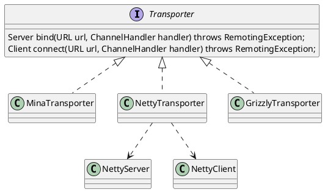

com.alibaba.dubbo.remoting.Transporter
## hierachy
```
Transporter (com.alibaba.dubbo.remoting)
    MinaTransporter (com.alibaba.dubbo.remoting.transport.mina)
    NettyTransporter (com.alibaba.dubbo.remoting.transport.netty)
    GrizzlyTransporter (com.alibaba.dubbo.remoting.transport.grizzly)
```

## define
* bind() 服务端绑定
* connect() 连接服务端



```java
@SPI("netty")
public interface Transporter {

    /**
     * Bind a server.
     *
     * @param url     server url
     * @param handler
     * @return server
     * @throws RemotingException
     * @see com.alibaba.dubbo.remoting.Transporters#bind(URL, Receiver, ChannelHandler)
     */
    @Adaptive({Constants.SERVER_KEY, Constants.TRANSPORTER_KEY})
    Server bind(URL url, ChannelHandler handler) throws RemotingException;

    /**
     * Connect to a server.
     *
     * @param url     server url
     * @param handler
     * @return client
     * @throws RemotingException
     * @see com.alibaba.dubbo.remoting.Transporters#connect(URL, Receiver, ChannelListener)
     */
    @Adaptive({Constants.CLIENT_KEY, Constants.TRANSPORTER_KEY})
    Client connect(URL url, ChannelHandler handler) throws RemotingException;

}
```