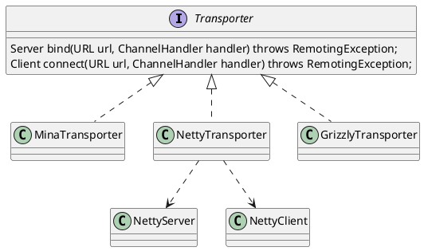

com.alibaba.dubbo.remoting.Transporter
## hierachy
```
Transporter (com.alibaba.dubbo.remoting)
    MinaTransporter (com.alibaba.dubbo.remoting.transport.mina)
    NettyTransporter (com.alibaba.dubbo.remoting.transport.netty)
    GrizzlyTransporter (com.alibaba.dubbo.remoting.transport.grizzly)
```

## define
* bind() 服务端绑定
* connect() 连接服务端



```java
@SPI("netty")
public interface Transporter {

    @Adaptive({Constants.SERVER_KEY, Constants.TRANSPORTER_KEY}) // server, transporter
    Server bind(URL url, ChannelHandler handler) throws RemotingException;

    @Adaptive({Constants.CLIENT_KEY, Constants.TRANSPORTER_KEY}) // client, transporter
    Client connect(URL url, ChannelHandler handler) throws RemotingException;
}
```
@Adaptive 自适应，当外部调用Transporter#bind方法时，会动态从传入的参数URL中提取key参数server的value值，如果能匹配上某个扩展点实现类则直接使用对应的实现类；
如果匹配不上，则继续通过地儿个key参数transporter提取value值，如果都没匹配上，则抛出异常。
