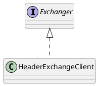

com.alibaba.dubbo.remoting.exchange.Exchanger

## hierarchy
```
Exchanger (com.alibaba.dubbo.remoting.exchange)
    HeaderExchanger (com.alibaba.dubbo.remoting.exchange.support.header)
```

## define



```java
@SPI(HeaderExchanger.NAME)
public interface Exchanger {
    @Adaptive({Constants.EXCHANGER_KEY})
    ExchangeServer bind(URL url, ExchangeHandler handler) throws RemotingException;
    
    @Adaptive({Constants.EXCHANGER_KEY})
    ExchangeClient connect(URL url, ExchangeHandler handler) throws RemotingException;
}
```