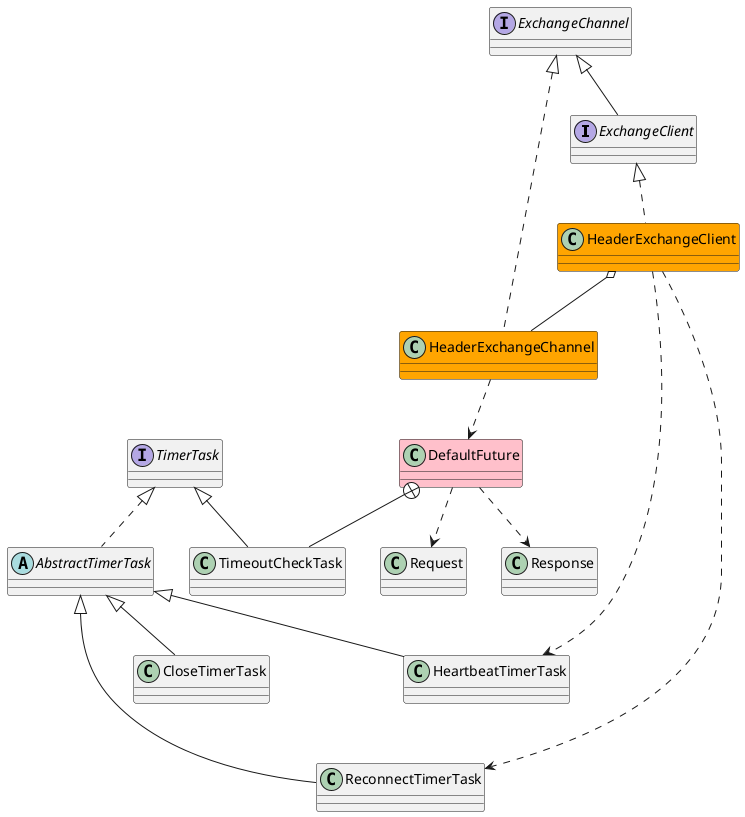

com.alibaba.dubbo.remoting.exchange

[Exchange信息交换层](https://blog.csdn.net/qq_26222859/article/details/80494154)

## pakcage
```
codec
    ExchangeCodec
support
    header
        HeaderExchangeChannel
        HeaderExchangeClient
        HeaderExchangeHandler
        HeaderExchanger
        HeaderExchangeServer
        HeartbeatHandler
        HeartBeatTask
    DefaultFuture
    ExchangeHandlerAdapter
    ExchangeHandlerDispatcher
    ExchangeServerDelegate
    MultiMessage
    Replier
    ReplierDispatcher
    SimpleFuture
ExchangeChannel
ExchangeClient
ExchangeHandler
Exchanger
Exchangers
ExchangeServer
Request
Response
ResponseCallback
ResponseFuture
```

## overview


```java
public interface ResponseCallback {
    void done(Object response);
    void caught(Throwable exception);
}
public interface ResponseFuture {
    Object get() throws RemotingException;
    Object get(int timeoutInMillis) throws RemotingException;
    void setCallback(ResponseCallback callback);
    boolean isDone();
}
```