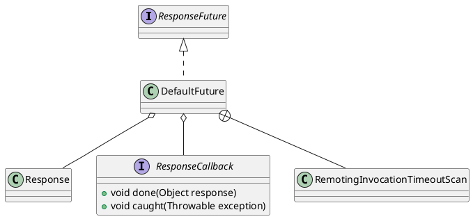

com.alibaba.dubbo.remoting.exchange.support.DefaultFuture

## hierarchy
```
ResponseFuture (com.alibaba.dubbo.remoting.exchange)
    DefaultFuture (com.alibaba.dubbo.remoting.exchange.support)
    SimpleFuture (com.alibaba.dubbo.remoting.exchange.support)
```

## define


```java
public class DefaultFuture implements ResponseFuture {
    private static final Logger logger = LoggerFactory.getLogger(DefaultFuture.class);
    private static final Map<Long, Channel> CHANNELS = new ConcurrentHashMap<Long, Channel>();
    private static final Map<Long, DefaultFuture> FUTURES = new ConcurrentHashMap<Long, DefaultFuture>();
    static {
        Thread th = new Thread(new RemotingInvocationTimeoutScan(), "DubboResponseTimeoutScanTimer");
        th.setDaemon(true);
        th.start();
    }
    // invoke id.
    private final long id;
    private final Channel channel;
    private final Request request;
    private final int timeout;
    private final Lock lock = new ReentrantLock();
    private final Condition done = lock.newCondition();
    private final long start = System.currentTimeMillis();
    private volatile long sent;
    private volatile Response response;
    private volatile ResponseCallback callback;
}    
```

## methods

### DefaultFuture
```java
    public DefaultFuture(Channel channel, Request request, int timeout) {
        this.channel = channel;
        this.request = request;
        this.id = request.getId(); // 请求id
        this.timeout = timeout > 0 ? timeout : channel.getUrl().getPositiveParameter(Constants.TIMEOUT_KEY, Constants.DEFAULT_TIMEOUT);
        // put into waiting map.
        FUTURES.put(id, this);
        CHANNELS.put(id, channel);
    }
```

### get
```java
    public Object get() throws RemotingException {
        return get(timeout);
    }

    public Object get(int timeout) throws RemotingException {
        if (timeout <= 0) {
            timeout = Constants.DEFAULT_TIMEOUT;
        }
        if (!isDone()) {
            long start = System.currentTimeMillis();
            lock.lock();
            try {
                while (!isDone()) {
                    done.await(timeout, TimeUnit.MILLISECONDS);
                    if (isDone() || System.currentTimeMillis() - start > timeout) {
                        break;
                    }
                }
            } catch (InterruptedException e) {
                throw new RuntimeException(e);
            } finally {
                lock.unlock();
            }
            if (!isDone()) {
                throw new TimeoutException(sent > 0, channel, getTimeoutMessage(false));
            }
        }
        return returnFromResponse();
    }
```

### setCallback
```java
    public void setCallback(ResponseCallback callback) {
        if (isDone()) {
            invokeCallback(callback);
        } else {
            boolean isdone = false;
            lock.lock();
            try {
                if (!isDone()) {
                    this.callback = callback;
                } else {
                    isdone = true;
                }
            } finally {
                lock.unlock();
            }
            if (isdone) {
                invokeCallback(callback);
            }
        }
    }
```

### invokeCallback
```java
    private void invokeCallback(ResponseCallback c) {
        ResponseCallback callbackCopy = c;
        if (callbackCopy == null) {
            throw new NullPointerException("callback cannot be null.");
        }
        c = null;
        Response res = response;
        if (res == null) {
            throw new IllegalStateException("response cannot be null. url:" + channel.getUrl());
        }

        if (res.getStatus() == Response.OK) {
            try {
                callbackCopy.done(res.getResult());
            } catch (Exception e) {
                logger.error("callback invoke error .reasult:" + res.getResult() + ",url:" + channel.getUrl(), e);
            }
        } else if (res.getStatus() == Response.CLIENT_TIMEOUT || res.getStatus() == Response.SERVER_TIMEOUT) {
            try {
                TimeoutException te = new TimeoutException(res.getStatus() == Response.SERVER_TIMEOUT, channel, res.getErrorMessage());
                callbackCopy.caught(te);
            } catch (Exception e) {
                logger.error("callback invoke error ,url:" + channel.getUrl(), e);
            }
        } else {
            try {
                RuntimeException re = new RuntimeException(res.getErrorMessage());
                callbackCopy.caught(re);
            } catch (Exception e) {
                logger.error("callback invoke error ,url:" + channel.getUrl(), e);
            }
        }
    }
```

## inner class

### RemotingInvocationTimeoutScan
```java
    private static class RemotingInvocationTimeoutScan implements Runnable {

        public void run() {
            while (true) {
                try {
                    for (DefaultFuture future : FUTURES.values()) {
                        if (future == null || future.isDone()) {
                            continue;
                        }
                        if (System.currentTimeMillis() - future.getStartTimestamp() > future.getTimeout()) {
                            // create exception response.
                            Response timeoutResponse = new Response(future.getId());
                            // set timeout status.
                            timeoutResponse.setStatus(future.isSent() ? Response.SERVER_TIMEOUT : Response.CLIENT_TIMEOUT);
                            timeoutResponse.setErrorMessage(future.getTimeoutMessage(true));
                            // handle response.
                            DefaultFuture.received(future.getChannel(), timeoutResponse);
                        }
                    }
                    Thread.sleep(30);
                } catch (Throwable e) {
                    logger.error("Exception when scan the timeout invocation of remoting.", e);
                }
            }
        }
    }
```