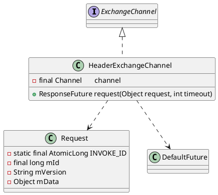

com.alibaba.dubbo.remoting.exchange.support.header.HeaderExchangeChannel

## hierarchy
```
ExchangeChannel (com.alibaba.dubbo.remoting.exchange)
    ExchangeClient (com.alibaba.dubbo.remoting.exchange)
        HeaderExchangeClient (com.alibaba.dubbo.remoting.exchange.support.header)
        LazyConnectExchangeClient (com.alibaba.dubbo.rpc.protocol.dubbo)
        ReferenceCountExchangeClient (com.alibaba.dubbo.rpc.protocol.dubbo)
    HeaderExchangeChannel (com.alibaba.dubbo.remoting.exchange.support.header)
```
## define
主要是完成同步转异步，在request(Object request,int timeout)方法中，
将请求转换成Request对象，将请求消息设置到data属性上，构建DefaultFuture对象，
调用NIO框架对应的Client对象（默认NettyClient）的send方法将消息发送出去，返回DefultFuture对象。



## methods

### request
- RpcInvocation -> Request
- [DefaultFuture](/docs/30-distributed/src/dubbo/remoting/exchange/support/DefaultFuture.md)

```java
    public ResponseFuture request(Object request) throws RemotingException {
        return request(request, channel.getUrl().getPositiveParameter(Constants.TIMEOUT_KEY, Constants.DEFAULT_TIMEOUT));
    }

    public ResponseFuture request(Object request, int timeout) throws RemotingException {
        if (closed) {
            throw new RemotingException(this.getLocalAddress(), null, "Failed to send request " + request + ", cause: The channel " + this + " is closed!");
        }
        // create request.
        Request req = new Request(); // 构造请求对象，默认AtomicLong生成mId
        req.setVersion("2.0.0");
        req.setTwoWay(true);
        req.setData(request);
        DefaultFuture future = new DefaultFuture(channel, req, timeout);
        try {
            channel.send(req);
        } catch (RemotingException e) {
            future.cancel();
            throw e;
        }
        return future;
    }
```

### close
```java
    // graceful close
    public void close(int timeout) {
        if (closed) {
            return;
        }
        closed = true;
        if (timeout > 0) {
            long start = System.currentTimeMillis();
            while (DefaultFuture.hasFuture(channel)
                    && System.currentTimeMillis() - start < timeout) {
                try {
                    Thread.sleep(10);
                } catch (InterruptedException e) {
                    logger.warn(e.getMessage(), e);
                }
            }
        }
        close();
    }
```

## class

### Request
```java
public class Request {
    
    private static final AtomicLong INVOKE_ID = new AtomicLong(0);
    private final long mId;
    
    public Request() {
        mId = newId();
    }
    private static long newId() {
        // getAndIncrement()增长到MAX_VALUE时，再增长会变为MIN_VALUE，负数也可以做为ID
        return INVOKE_ID.getAndIncrement();
    }
}    
```