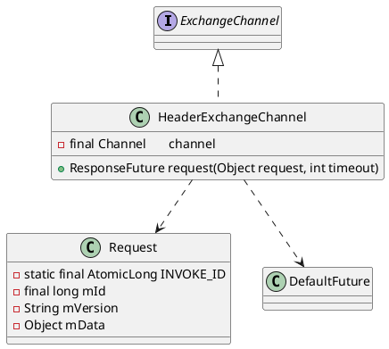

com.alibaba.dubbo.remoting.exchange.support.header.HeaderExchangeChannel

## hierarchy
```
ExchangeChannel (com.alibaba.dubbo.remoting.exchange)
    ExchangeClient (com.alibaba.dubbo.remoting.exchange)
        HeaderExchangeClient (com.alibaba.dubbo.remoting.exchange.support.header)
        LazyConnectExchangeClient (com.alibaba.dubbo.rpc.protocol.dubbo)
        ReferenceCountExchangeClient (com.alibaba.dubbo.rpc.protocol.dubbo)
    HeaderExchangeChannel (com.alibaba.dubbo.remoting.exchange.support.header)
```
## define



## desc
主要是完成同步转异步，在request(Object request,int timeout)方法中，
将请求转换成Request对象，将请求消息设置到data属性上，构建DefaultFuture对象，
调用NIO框架对应的Client对象（默认NettyClient）的send方法将消息发送出去，返回DefultFuture对象。

## method

### request
RpcInvocation -> Request