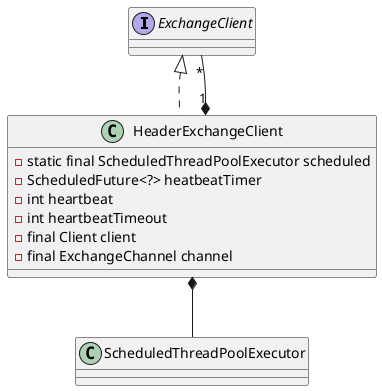

com.alibaba.dubbo.remoting.exchange.support.header.HeaderExchangeClient

* ScheduledThreadPoolExecutor
* ScheduledFuture

## define



```java
public class HeaderExchangeClient implements ExchangeClient {
    private static final ScheduledThreadPoolExecutor scheduled = new ScheduledThreadPoolExecutor(2, new NamedThreadFactory("dubbo-remoting-client-heartbeat", true));
    private final Client client;
    private final ExchangeChannel channel;
    // 心跳定时器
    private ScheduledFuture<?> heatbeatTimer;
    // 心跳超时，毫秒。缺省0，不会执行心跳。
    private int heartbeat;
    private int heartbeatTimeout;
}    
```

## desc
提供心跳检查功能；
将send、request、close等事件转由HeaderExchangeChannel处理，HeaderExchangeChannel对象中的Channel为所选的NIO框架对应的client对象；
以request为例，调用流程如下：
- HeaderExchangeClient.request(Object request)
- HeaderExchangeChannel.request(Object request)
- (NettyClient)AbstractPeer.send(Object message)
- (NettyClient)AbstractClient.send(Object message,boolean sent)。

## methods

### HeaderExchangeClient
```java
    public HeaderExchangeClient(Client client) {
        if (client == null) {
            throw new IllegalArgumentException("client == null");
        }
        this.client = client;
        this.channel = new HeaderExchangeChannel(client);
        String dubbo = client.getUrl().getParameter(Constants.DUBBO_VERSION_KEY);
        this.heartbeat = client.getUrl().getParameter(Constants.HEARTBEAT_KEY, dubbo != null && dubbo.startsWith("1.0.") ? Constants.DEFAULT_HEARTBEAT : 0);
        this.heartbeatTimeout = client.getUrl().getParameter(Constants.HEARTBEAT_TIMEOUT_KEY, heartbeat * 3);
        if (heartbeatTimeout < heartbeat * 2) {
            throw new IllegalStateException("heartbeatTimeout < heartbeatInterval * 2");
        }
        startHeatbeatTimer();
    }
```

### startHeatbeatTimer
- [HeartBeatTask](/docs/30-distributed/src/dubbo/remoting/exchange/support/header/HeartBeatTask.md)

```java
    private void startHeatbeatTimer() {
        stopHeartbeatTimer();
        if (heartbeat > 0) {
            heatbeatTimer = scheduled.scheduleWithFixedDelay(
                    new HeartBeatTask(new HeartBeatTask.ChannelProvider() {
                        public Collection<Channel> getChannels() {
                            return Collections.<Channel>singletonList(HeaderExchangeClient.this);
                        }
                    }, heartbeat, heartbeatTimeout),
                    heartbeat, heartbeat, TimeUnit.MILLISECONDS);
        }
    }
```