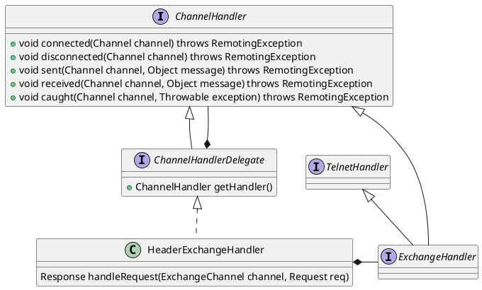

com.alibaba.dubbo.remoting.exchange.support.header.HeaderExchangeHandler

## define


```java
public class HeaderExchangeHandler implements ChannelHandlerDelegate {
    public static String KEY_READ_TIMESTAMP = HeartbeatHandler.KEY_READ_TIMESTAMP;
    public static String KEY_WRITE_TIMESTAMP = HeartbeatHandler.KEY_WRITE_TIMESTAMP;
    private final ExchangeHandler handler;
}    
```

## methods
- connected
- disconnected
- sent
- received
- caught

### received
```java
    public void received(Channel channel, Object message) throws RemotingException {
        channel.setAttribute(KEY_READ_TIMESTAMP, System.currentTimeMillis()); // 更新事件时间戳
        ExchangeChannel exchangeChannel = HeaderExchangeChannel.getOrAddChannel(channel);
        try {
            if (message instanceof Request) {
                // handle request.
                Request request = (Request) message;
                if (request.isEvent()) {
                    handlerEvent(channel, request);
                } else {
                    if (request.isTwoWay()) {
                        Response response = handleRequest(exchangeChannel, request);
                        channel.send(response);
                    } else {
                        handler.received(exchangeChannel, request.getData());
                    }
                }
            } else if (message instanceof Response) {
                handleResponse(channel, (Response) message);
            } else if (message instanceof String) {
                if (isClientSide(channel)) {
                    Exception e = new Exception("Dubbo client can not supported string message: " + message + " in channel: " + channel + ", url: " + channel.getUrl());
                    logger.error(e.getMessage(), e);
                } else {
                    String echo = handler.telnet(channel, (String) message);
                    if (echo != null && echo.length() > 0) {
                        channel.send(echo);
                    }
                }
            } else {
                handler.received(exchangeChannel, message);
            }
        } finally {
            HeaderExchangeChannel.removeChannelIfDisconnected(channel);
        }
    }
```

### handleRequest
```java
    Response handleRequest(ExchangeChannel channel, Request req) throws RemotingException {
        Response res = new Response(req.getId(), req.getVersion());
        if (req.isBroken()) {
            Object data = req.getData();

            String msg;
            if (data == null) msg = null;
            else if (data instanceof Throwable) msg = StringUtils.toString((Throwable) data);
            else msg = data.toString();
            res.setErrorMessage("Fail to decode request due to: " + msg);
            res.setStatus(Response.BAD_REQUEST);

            return res;
        }
        // find handler by message class.
        Object msg = req.getData();
        try {
            // handle data.
            Object result = handler.reply(channel, msg);
            res.setStatus(Response.OK);
            res.setResult(result);
        } catch (Throwable e) {
            res.setStatus(Response.SERVICE_ERROR);
            res.setErrorMessage(StringUtils.toString(e));
        }
        return res;
    }
```
### handlerEvent
```java
    void handlerEvent(Channel channel, Request req) throws RemotingException {
        if (req.getData() != null && req.getData().equals(Request.READONLY_EVENT)) {
            channel.setAttribute(Constants.CHANNEL_ATTRIBUTE_READONLY_KEY, Boolean.TRUE);
        }
    }
```

### handleResponse
```java
    static void handleResponse(Channel channel, Response response) throws RemotingException {
        if (response != null && !response.isHeartbeat()) {
            DefaultFuture.received(channel, response);
        }
    }
```