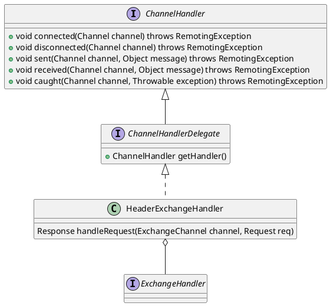

com.alibaba.dubbo.remoting.exchange.support.header.HeaderExchangeHandler

## define
* 建立连接通道
* 关闭连接通道
* 向通道发送数据
* 接收通道里数据
* 异常

```plantuml
@startuml

interface ChannelHandler {
    + void connected(Channel channel) throws RemotingException
    + void disconnected(Channel channel) throws RemotingException
    + void sent(Channel channel, Object message) throws RemotingException
    + void received(Channel channel, Object message) throws RemotingException
    + void caught(Channel channel, Throwable exception) throws RemotingException
}

ChannelHandler ^-- ChannelHandlerDelegate
interface ChannelHandlerDelegate {
    + ChannelHandler getHandler()
}

ChannelHandlerDelegate ^.. HeaderExchangeHandler
class HeaderExchangeHandler {
    Response handleRequest(ExchangeChannel channel, Request req)
}

HeaderExchangeHandler o-- ExchangeHandler
interface ExchangeHandler

@enduml
```