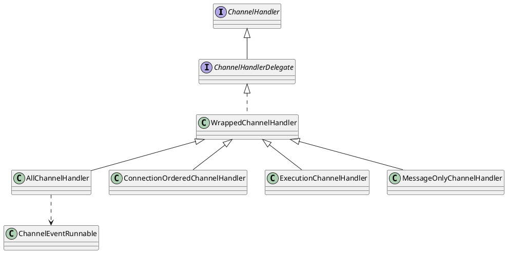

com.alibaba.dubbo.remoting.transport.dispatcher.all.AllChannelHandler

- [WrappedChannelHandler](/docs/30-distributed/src/dubbo/remoting/transport/dispatcher/WrappedChannelHandler.md)
- [ChannelEventRunnable](/docs/30-distributed/src/dubbo/remoting/transport/dispatcher/ChannelEventRunnable.md)

## hierarchy
```
WrappedChannelHandler (com.alibaba.dubbo.remoting.transport.dispatcher)
    AllChannelHandler (com.alibaba.dubbo.remoting.transport.dispatcher.all)
    ConnectionOrderedChannelHandler (com.alibaba.dubbo.remoting.transport.dispatcher.connection)
    ExecutionChannelHandler (com.alibaba.dubbo.remoting.transport.dispatcher.execution)
    MessageOnlyChannelHandler (com.alibaba.dubbo.remoting.transport.dispatcher.message)
```

## define


## methods

### connected
```java
    public void connected(Channel channel) throws RemotingException {
        ExecutorService cexecutor = getExecutorService();
        try {
            cexecutor.execute(new ChannelEventRunnable(channel, handler, ChannelState.CONNECTED));
        } catch (Throwable t) {
            throw new ExecutionException("connect event", channel, getClass() + " error when process connected event .", t);
        }
    }
```

### disconnected
```java
    public void disconnected(Channel channel) throws RemotingException {
        ExecutorService cexecutor = getExecutorService();
        try {
            cexecutor.execute(new ChannelEventRunnable(channel, handler, ChannelState.DISCONNECTED));
        } catch (Throwable t) {
            throw new ExecutionException("disconnect event", channel, getClass() + " error when process disconnected event .", t);
        }
    }
```

### received
```java
    public void received(Channel channel, Object message) throws RemotingException {
        ExecutorService cexecutor = getExecutorService();
        try {
            cexecutor.execute(new ChannelEventRunnable(channel, handler, ChannelState.RECEIVED, message));
        } catch (Throwable t) {
            throw new ExecutionException(message, channel, getClass() + " error when process received event .", t);
        }
    }
```

### caught
```java
    public void caught(Channel channel, Throwable exception) throws RemotingException {
        ExecutorService cexecutor = getExecutorService();
        try {
            cexecutor.execute(new ChannelEventRunnable(channel, handler, ChannelState.CAUGHT, exception));
        } catch (Throwable t) {
            throw new ExecutionException("caught event", channel, getClass() + " error when process caught event .", t);
        }
    }
```

### getExecutorService
```java
    private ExecutorService getExecutorService() {
        ExecutorService cexecutor = executor;
        if (cexecutor == null || cexecutor.isShutdown()) {
            cexecutor = SHARED_EXECUTOR;
        }
        return cexecutor;
    }
```