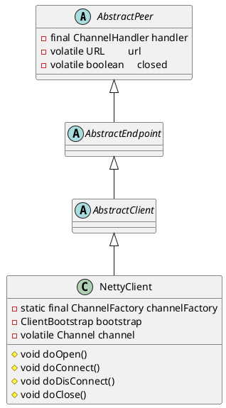

com.alibaba.dubbo.remoting.transport.netty.NettyClient

## hierarchy
```
AbstractPeer (com.alibaba.dubbo.remoting.transport)
    AbstractEndpoint (com.alibaba.dubbo.remoting.transport)
        AbstractClient (com.alibaba.dubbo.remoting.transport)
            NettyClient (com.alibaba.dubbo.remoting.transport.netty)
            GrizzlyClient (com.alibaba.dubbo.remoting.transport.grizzly)
            MinaClient (com.alibaba.dubbo.remoting.transport.mina)
        AbstractServer (com.alibaba.dubbo.remoting.transport)
            NettyServer (com.alibaba.dubbo.remoting.transport.netty)
            GrizzlyServer (com.alibaba.dubbo.remoting.transport.grizzly)
            MinaServer (com.alibaba.dubbo.remoting.transport.mina)
    AbstractChannel (com.alibaba.dubbo.remoting.transport)
        MinaChannel (com.alibaba.dubbo.remoting.transport.mina)
        NettyChannel (com.alibaba.dubbo.remoting.transport.netty)
        GrizzlyChannel (com.alibaba.dubbo.remoting.transport.grizzly)
```

## define

