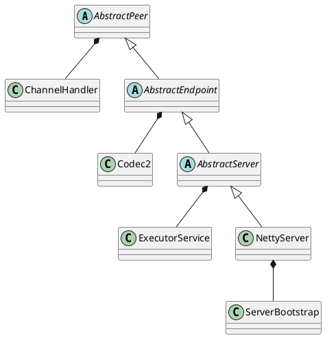

com.alibaba.dubbo.remoting.transport.netty.NettyServer

## hierarchy
```
AbstractPeer (com.alibaba.dubbo.remoting.transport)
    AbstractEndpoint (com.alibaba.dubbo.remoting.transport)
        AbstractServer (com.alibaba.dubbo.remoting.transport)
            NettyServer (com.alibaba.dubbo.remoting.transport.netty)
```
## define


## methods

### doOpen
```java
    protected void doOpen() throws Throwable {
        NettyHelper.setNettyLoggerFactory();
        ExecutorService boss = Executors.newCachedThreadPool(new NamedThreadFactory("NettyServerBoss", true));
        ExecutorService worker = Executors.newCachedThreadPool(new NamedThreadFactory("NettyServerWorker", true));
        
        // public static final int DEFAULT_IO_THREADS = Math.min(Runtime.getRuntime().availableProcessors() + 1, 32);
        ChannelFactory channelFactory = new NioServerSocketChannelFactory(boss, worker, getUrl().getPositiveParameter(Constants.IO_THREADS_KEY, Constants.DEFAULT_IO_THREADS));
        bootstrap = new ServerBootstrap(channelFactory);

        final NettyHandler nettyHandler = new NettyHandler(getUrl(), this);
        channels = nettyHandler.getChannels();
        // https://issues.jboss.org/browse/NETTY-365
        // https://issues.jboss.org/browse/NETTY-379
        // final Timer timer = new HashedWheelTimer(new NamedThreadFactory("NettyIdleTimer", true));
        bootstrap.setPipelineFactory(new ChannelPipelineFactory() {
            public ChannelPipeline getPipeline() {
                NettyCodecAdapter adapter = new NettyCodecAdapter(getCodec(), getUrl(), NettyServer.this);
                ChannelPipeline pipeline = Channels.pipeline();
                /*int idleTimeout = getIdleTimeout();
                if (idleTimeout > 10000) {
                    pipeline.addLast("timer", new IdleStateHandler(timer, idleTimeout / 1000, 0, 0));
                }*/
                pipeline.addLast("decoder", adapter.getDecoder());
                pipeline.addLast("encoder", adapter.getEncoder());
                pipeline.addLast("handler", nettyHandler);
                return pipeline;
            }
        });
        // bind
        channel = bootstrap.bind(getBindAddress());
    }
```


[Dubbo源代码实现六：线程池模型与提供者](https://www.iteye.com/blog/manzhizhen-2380055)

```xml
<dubbo:protocol name="dubbo" port="8888" threads="500" accepts="200"/>
```
```
Caused by: java.util.concurrent.RejectedExecutionException: Thread pool is EXHAUSTED! Thread Name: DubboServerHandler-提供者IP+端口, Pool Size: 300
```