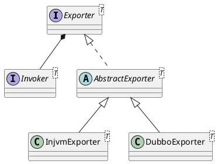

com.alibaba.dubbo.rpc.Exporter

## hierarchy
```
Exporter (com.alibaba.dubbo.rpc)
    ExporterChangeableWrapper in RegistryProtocol (com.alibaba.dubbo.registry.integration)
    1 in RegistryProtocol (com.alibaba.dubbo.registry.integration)
    AbstractExporter (com.alibaba.dubbo.rpc.protocol)
        1 in AbstractProxyProtocol (com.alibaba.dubbo.rpc.protocol)
        InjvmExporter (com.alibaba.dubbo.rpc.protocol.injvm)
        DubboExporter (com.alibaba.dubbo.rpc.protocol.dubbo)
    ListenerExporterWrapper (com.alibaba.dubbo.rpc.listener)
    DelegateExporter (com.alibaba.dubbo.rpc.support)
```

## define


```java
public interface Exporter<T> {
    Invoker<T> getInvoker();
    void unexport();
}
```

```yuml

// {type:class}

[Exporter||+getInvoker();+unexport()]

// 导出服务者的实现，虚拟机内部、远程导出不同
[Exporter]^-.-[AbstractExporter]
[AbstractExporter]^-[InjvmExporter{bg:thistle}]
[AbstractExporter]^-[DubboExporter{bg:thistle}]

[Exporter]^-.-[ListenerExporterWrapper]
[Exporter]^-.-[DelegateExporter]

// 分布式节点
[Node{bg:wheat}]^-[Invoker{bg:wheat}]
[Exporter]++-[Invoker]
```