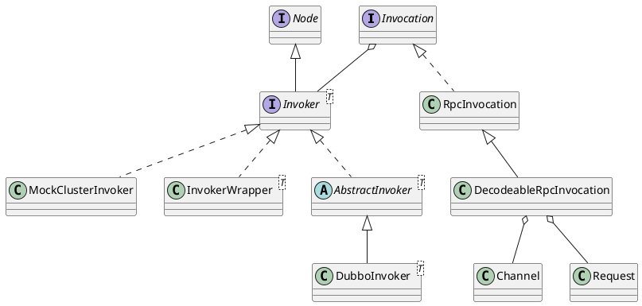

com.alibaba.dubbo.rpc.Invocation

## hierarchy
```
Invocation (com.alibaba.dubbo.rpc)
    RpcInvocation (com.alibaba.dubbo.rpc)
        DecodeableRpcInvocation (com.alibaba.dubbo.rpc.protocol.dubbo)
```

## 定义
* Invocation 封装了方法名称、方法参数类型、方法参数值、附加属性
* method.invoker(proxy, args)对反射方法抽象

```java
public interface Invocation {
    // 方法名
	String getMethodName();
	// 参数类型
	Class<?>[] getParameterTypes();
	// 参数值
	Object[] getArguments();
	// 复件属性
	Map<String, String> getAttachments();
	String getAttachment(String key);
	String getAttachment(String key, String defaultValue);
	// 调用者
    Invoker<?> getInvoker();
}
```

