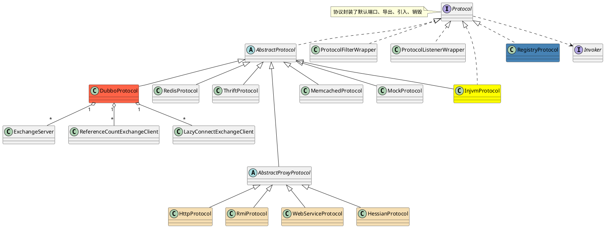

com.alibaba.dubbo.rpc.Protocol

## hierarchy
```
Protocol (com.alibaba.dubbo.rpc)
    AbstractProtocol (com.alibaba.dubbo.rpc.protocol)
        RedisProtocol (com.alibaba.dubbo.rpc.protocol.redis)                Redis协议
        InjvmProtocol (com.alibaba.dubbo.rpc.protocol.injvm)                Injvm协议
        DubboProtocol (com.alibaba.dubbo.rpc.protocol.dubbo)                Dubbo协议
        ThriftProtocol (com.alibaba.dubbo.rpc.protocol.thrift)              Thrift协议
        MemcachedProtocol (com.alibaba.dubbo.rpc.protocol.memcached)        Memcached协议
        MockProtocol (com.alibaba.dubbo.rpc.support)                        Mock协议
        AbstractProxyProtocol (com.alibaba.dubbo.rpc.protocol)
            HttpProtocol (com.alibaba.dubbo.rpc.protocol.http)                  Http协议
            RmiProtocol (com.alibaba.dubbo.rpc.protocol.rmi)                    Rmi协议
            WebServiceProtocol (com.alibaba.dubbo.rpc.protocol.webservice)      WebService协议
            HessianProtocol (com.alibaba.dubbo.rpc.protocol.hessian)            Hession协议
    ProtocolFilterWrapper (com.alibaba.dubbo.rpc.protocol)
    ProtocolListenerWrapper (com.alibaba.dubbo.rpc.protocol)
    InjvmProtocol (com.alibaba.dubbo.rpc.protocol.injvm)
    RegistryProtocol (com.alibaba.dubbo.registry.integration)
```

## define
* 定义了端口、导出、导入、销毁规约
* 基于netty的多协议开发
* 通信协议定义了通信中的语法学, 语义学和同步规则以及可能存在的错误检测与纠正




```java
@SPI("dubbo")
public interface Protocol {

    /**
     * 获取缺省端口，当用户没有配置端口时使用。
     *
     * @return 缺省端口
     */
    int getDefaultPort();

    /**
     * 暴露远程服务：<br>
     * 1. 协议在接收请求时，应记录请求来源方地址信息：RpcContext.getContext().setRemoteAddress();<br>
     * 2. export()必须是幂等的，也就是暴露同一个URL的Invoker两次，和暴露一次没有区别。<br>
     * 3. export()传入的Invoker由框架实现并传入，协议不需要关心。<br>
     *
     * @param <T>     服务的类型
     * @param invoker 服务的执行体
     * @return exporter 暴露服务的引用，用于取消暴露
     * @throws RpcException 当暴露服务出错时抛出，比如端口已占用
     */
    @Adaptive
    <T> Exporter<T> export(Invoker<T> invoker) throws RpcException;

    /**
     * 引用远程服务：<br>
     * 1. 当用户调用refer()所返回的Invoker对象的invoke()方法时，协议需相应执行同URL远端export()传入的Invoker对象的invoke()方法。<br>
     * 2. refer()返回的Invoker由协议实现，协议通常需要在此Invoker中发送远程请求。<br>
     * 3. 当url中有设置check=false时，连接失败不能抛出异常，并内部自动恢复。<br>
     *
     * @param <T>  服务的类型
     * @param type 服务的类型
     * @param url  远程服务的URL地址
     * @return invoker 服务的本地代理
     * @throws RpcException 当连接服务提供方失败时抛出
     */
    @Adaptive
    <T> Invoker<T> refer(Class<T> type, URL url) throws RpcException;

    /**
     * 释放协议：<br>
     * 1. 取消该协议所有已经暴露和引用的服务。<br>
     * 2. 释放协议所占用的所有资源，比如连接和端口。<br>
     * 3. 协议在释放后，依然能暴露和引用新的服务。<br>
     */
    void destroy();

}
```