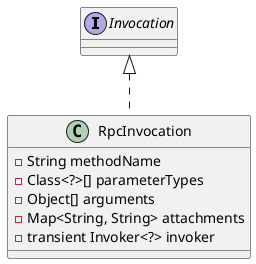

com.alibaba.dubbo.rpc.RpcInvocation

## define



```java
public class RpcInvocation implements Invocation, Serializable {
    private static final long serialVersionUID = -4355285085441097045L;
    private String methodName;
    private Class<?>[] parameterTypes;
    private Object[] arguments;
    private Map<String, String> attachments;
    private transient Invoker<?> invoker;
}    
```