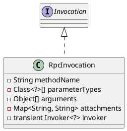

com.alibaba.dubbo.rpc.RpcInvocation

## define

```plantuml
@startuml

interface Invocation
Invocation ^.. RpcInvocation

class RpcInvocation {
    - String methodName
    - Class<?>[] parameterTypes
    - Object[] arguments
    - Map<String, String> attachments
    - transient Invoker<?> invoker
}

@enduml
```