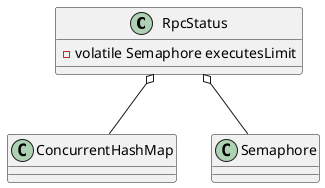

com.alibaba.dubbo.rpc.RpcStatus

* ConcurrentHashMap
* Semaphore
* AtomicInteger
* AtomicLong
  * volatile long + while + compareAndSwapLong
  * getAndAddLong  getLongVolatile + compareAndSwapLong + while
  
## define


```java
public class RpcStatus {

    private static final ConcurrentMap<String, RpcStatus> SERVICE_STATISTICS = new ConcurrentHashMap<String, RpcStatus>();

    private static final ConcurrentMap<String, ConcurrentMap<String, RpcStatus>> METHOD_STATISTICS = new ConcurrentHashMap<String, ConcurrentMap<String, RpcStatus>>();
    private final ConcurrentMap<String, Object> values = new ConcurrentHashMap<String, Object>();
    private final AtomicInteger active = new AtomicInteger();
    private final AtomicLong total = new AtomicLong();
    private final AtomicInteger failed = new AtomicInteger();
    private final AtomicLong totalElapsed = new AtomicLong();
    private final AtomicLong failedElapsed = new AtomicLong();
    private final AtomicLong maxElapsed = new AtomicLong();
    private final AtomicLong failedMaxElapsed = new AtomicLong();
    private final AtomicLong succeededMaxElapsed = new AtomicLong();

    /**
     * 用来实现executes属性的并发限制（即控制能使用的线程数）
     * 2017-08-21 yizhenqiang
     */
    private volatile Semaphore executesLimit;
    private volatile int executesPermits;
}    
```

## methods

### RpcStatus
```java
    public static RpcStatus getStatus(URL url) {
        String uri = url.toIdentityString();
        RpcStatus status = SERVICE_STATISTICS.get(uri);
        if (status == null) {
            SERVICE_STATISTICS.putIfAbsent(uri, new RpcStatus());
            status = SERVICE_STATISTICS.get(uri);
        }
        return status;
    }
```
### getStatus
```java
    public static RpcStatus getStatus(URL url, String methodName) {
        String uri = url.toIdentityString();
        ConcurrentMap<String, RpcStatus> map = METHOD_STATISTICS.get(uri);
        if (map == null) {
            METHOD_STATISTICS.putIfAbsent(uri, new ConcurrentHashMap<String, RpcStatus>());
            map = METHOD_STATISTICS.get(uri);
        }
        RpcStatus status = map.get(methodName);
        if (status == null) {
            map.putIfAbsent(methodName, new RpcStatus());
            status = map.get(methodName);
        }
        return status;
    }
```

### getSemaphore
```java
    public Semaphore getSemaphore(int maxThreadNum) {
        if(maxThreadNum <= 0) {
            return null;
        }

        if (executesLimit == null || executesPermits != maxThreadNum) {
            synchronized (this) {
                if (executesLimit == null || executesPermits != maxThreadNum) {
                    executesLimit = new Semaphore(maxThreadNum);
                    executesPermits = maxThreadNum;
                }
            }
        }

        return executesLimit;
    }
```

## links
- [RpcStatus](/docs/30-distributed/src/dubbo/rpc/RpcStatus.md)
- [ActiveLimitFilter](/docs/30-distributed/src/dubbo/rpc/filter/ActiveLimitFilter.md)
- [ExecuteLimitFilter](/docs/30-distributed/src/dubbo/rpc/filter/ExecuteLimitFilter.md)