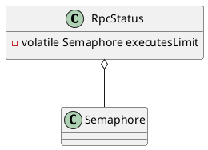

com.alibaba.dubbo.rpc.RpcStatus

* ConcurrentHashMap
* Semaphore
* AtomicInteger
* AtomicLong
  * volatile long + while + compareAndSwapLong
  * getAndAddLong  getLongVolatile + compareAndSwapLong + while
  
## define

  