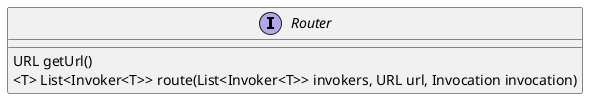

com.alibaba.dubbo.rpc.cluster.Router

## hierarchy
```
Router (com.alibaba.dubbo.rpc.cluster)
    MockInvokersSelector (com.alibaba.dubbo.rpc.cluster.router)
    ConditionRouter (com.alibaba.dubbo.rpc.cluster.router.condition)
    ScriptRouter (com.alibaba.dubbo.rpc.cluster.router.script)
```

## define
