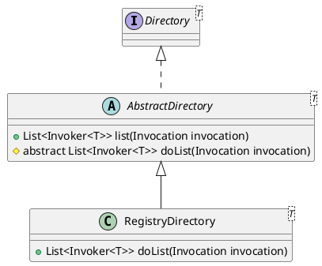

com.alibaba.dubbo.rpc.cluster.directory.AbstractDirectory

## hierachy
```
Directory (com.alibaba.dubbo.rpc.cluster)
    AbstractDirectory (com.alibaba.dubbo.rpc.cluster.directory)
        RegistryDirectory (com.alibaba.dubbo.registry.integration)
        StaticDirectory (com.alibaba.dubbo.rpc.cluster.directory)
```

## define



```java
public abstract class AbstractDirectory<T> implements Directory<T> {
    private final URL url;
    private volatile boolean destroyed = false;
    private volatile URL consumerUrl;
    private volatile List<Router> routers;
}
```

## methods

### list
```java
    public List<Invoker<T>> list(Invocation invocation) throws RpcException {
        if (destroyed) {
            throw new RpcException("Directory already destroyed .url: " + getUrl());
        }
        List<Invoker<T>> invokers = doList(invocation);
        List<Router> localRouters = this.routers; // local reference
        if (localRouters != null && localRouters.size() > 0) {
            for (Router router : localRouters) {
                try {
                    if (router.getUrl() == null || router.getUrl().getParameter(Constants.RUNTIME_KEY, true)) {
                        invokers = router.route(invokers, getConsumerUrl(), invocation);
                    }
                } catch (Throwable t) {
                    logger.error("Failed to execute router: " + getUrl() + ", cause: " + t.getMessage(), t);
                }
            }
        }
        return invokers;
    }
```