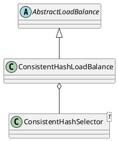

com.alibaba.dubbo.rpc.cluster.loadbalance.ConsistentHashLoadBalance

- ConcurrentMap
- TreeMap
- 一致性 Hash，相同参数的请求总是发到同一提供者。
  当某一台提供者挂时，原本发往该提供者的请求，基于虚拟节点，平摊到其它提供者，不会引起剧烈变动。

## hierarchy
```
AbstractLoadBalance (com.alibaba.dubbo.rpc.cluster.loadbalance)
    RandomLoadBalance (com.alibaba.dubbo.rpc.cluster.loadbalance)
    LeastActiveLoadBalance (com.alibaba.dubbo.rpc.cluster.loadbalance)
    RoundRobinLoadBalance (com.alibaba.dubbo.rpc.cluster.loadbalance)
    ConsistentHashLoadBalance (com.alibaba.dubbo.rpc.cluster.loadbalance)
```

## define


```java
public class ConsistentHashLoadBalance extends AbstractLoadBalance {
    private final ConcurrentMap<String, ConsistentHashSelector<?>> selectors = new ConcurrentHashMap<String, ConsistentHashSelector<?>>();
}    
```

## inner class

### ConsistentHashSelector
```java
    private static final class ConsistentHashSelector<T> {
        private final TreeMap<Long, Invoker<T>> virtualInvokers;
        private final int replicaNumber;
        private final int identityHashCode;
        private final int[] argumentIndex;
        
        public Invoker<T> select(Invocation invocation) {
            String key = toKey(invocation.getArguments());
            byte[] digest = md5(key);
            Invoker<T> invoker = sekectForKey(hash(digest, 0));
            return invoker;
        }
        
        private Invoker<T> sekectForKey(long hash) {
            Invoker<T> invoker;
            Long key = hash;
            if (!virtualInvokers.containsKey(key)) {
                SortedMap<Long, Invoker<T>> tailMap = virtualInvokers.tailMap(key);
                if (tailMap.isEmpty()) {
                    key = virtualInvokers.firstKey();
                } else {
                    key = tailMap.firstKey();
                }
            }
            invoker = virtualInvokers.get(key);
            return invoker;
        }
    }    
```