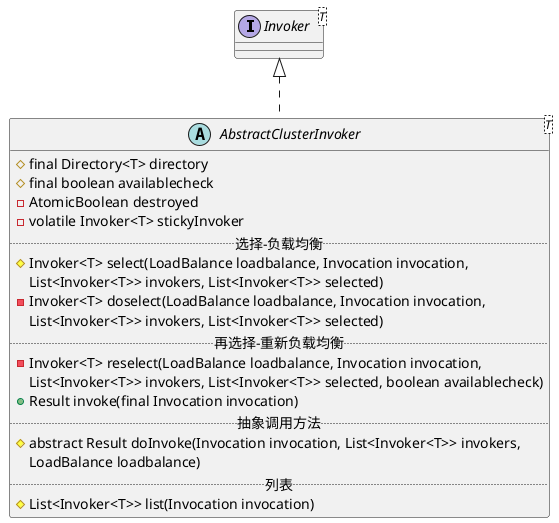

com.alibaba.dubbo.rpc.cluster.support.AbstractClusterInvoker

## hierarchy
```
AbstractClusterInvoker (com.alibaba.dubbo.rpc.cluster.support)
    1 in AvailableCluster (com.alibaba.dubbo.rpc.cluster.support)
    AvailableClusterInvoker (com.alibaba.dubbo.rpc.cluster.support)
    BroadcastClusterInvoker (com.alibaba.dubbo.rpc.cluster.support)
    FailbackClusterInvoker (com.alibaba.dubbo.rpc.cluster.support)
    FailfastClusterInvoker (com.alibaba.dubbo.rpc.cluster.support)
    FailoverClusterInvoker (com.alibaba.dubbo.rpc.cluster.support)
    FailsafeClusterInvoker (com.alibaba.dubbo.rpc.cluster.support)
    ForkingClusterInvoker (com.alibaba.dubbo.rpc.cluster.support)
```

## define

