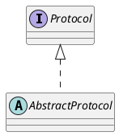

com.alibaba.dubbo.rpc.protocol.AbstractProtocol

* ConcurrentHashMap
* ConcurrentHashSet

## hierarchy
```
AbstractProtocol (com.alibaba.dubbo.rpc.protocol)
    AbstractProxyProtocol (com.alibaba.dubbo.rpc.protocol)
        HessianProtocol (com.alibaba.dubbo.rpc.protocol.hessian)
        HttpProtocol (com.alibaba.dubbo.rpc.protocol.http)
        RmiProtocol (com.alibaba.dubbo.rpc.protocol.rmi)
        WebServiceProtocol (com.alibaba.dubbo.rpc.protocol.webservice)
    DubboProtocol (com.alibaba.dubbo.rpc.protocol.dubbo)
    InjvmProtocol (com.alibaba.dubbo.rpc.protocol.injvm)
    MemcachedProtocol (com.alibaba.dubbo.rpc.protocol.memcached)
    MockProtocol (com.alibaba.dubbo.rpc.support)
    RedisProtocol (com.alibaba.dubbo.rpc.protocol.redis)
    ThriftProtocol (com.alibaba.dubbo.rpc.protocol.thrift)
```

## define


## fileds
```java
    protected final Map<String, Exporter<?>> exporterMap = new ConcurrentHashMap<String, Exporter<?>>();

    //TODO SOFEREFENCE
    protected final Set<Invoker<?>> invokers = new ConcurrentHashSet<Invoker<?>>();
```

## methods

### serviceKey
```java
    protected static String serviceKey(URL url) {
        return ProtocolUtils.serviceKey(url);
    }

    protected static String serviceKey(int port, String serviceName, String serviceVersion, String serviceGroup) {
        return ProtocolUtils.serviceKey(port, serviceName, serviceVersion, serviceGroup);
    }
```