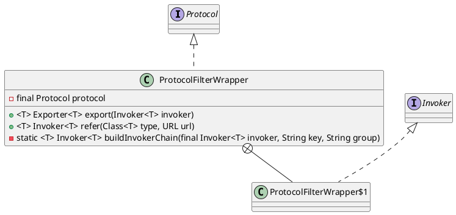

com.alibaba.dubbo.rpc.protocol.ProtocolFilterWrapper

## hierarchy
```
Protocol (com.alibaba.dubbo.rpc)
    AbstractProtocol (com.alibaba.dubbo.rpc.protocol)
    ProtocolFilterWrapper (com.alibaba.dubbo.rpc.protocol)
    ProtocolListenerWrapper (com.alibaba.dubbo.rpc.protocol)
    InjvmProtocol (com.alibaba.dubbo.rpc.protocol.injvm)
    RegistryProtocol (com.alibaba.dubbo.registry.integration)
```
## define
* 导出、引入时构建调用者链



```java
public class ProtocolFilterWrapper implements Protocol {
    private final Protocol protocol;
}    
```

## methods

### wrapper methods
```java
    public int getDefaultPort() {
        return protocol.getDefaultPort();
    }

    public <T> Exporter<T> export(Invoker<T> invoker) throws RpcException {
        if (Constants.REGISTRY_PROTOCOL.equals(invoker.getUrl().getProtocol())) {
            return protocol.export(invoker);
        }
        return protocol.export(buildInvokerChain(invoker, Constants.SERVICE_FILTER_KEY, Constants.PROVIDER));
    }

    public <T> Invoker<T> refer(Class<T> type, URL url) throws RpcException {
        if (Constants.REGISTRY_PROTOCOL.equals(url.getProtocol())) {
            return protocol.refer(type, url);
        }
        return buildInvokerChain(protocol.refer(type, url), Constants.REFERENCE_FILTER_KEY, Constants.CONSUMER);
    }

    public void destroy() {
        protocol.destroy();
    }
```

### buildInvokerChain
```java
    private static <T> Invoker<T> buildInvokerChain(final Invoker<T> invoker, String key, String group) {
        Invoker<T> last = invoker;
        List<Filter> filters = ExtensionLoader.getExtensionLoader(Filter.class).getActivateExtension(invoker.getUrl(), key, group);
        if (filters.size() > 0) {
            for (int i = filters.size() - 1; i >= 0; i--) {
                final Filter filter = filters.get(i);
                final Invoker<T> next = last;
                last = new Invoker<T>() {

                    public Class<T> getInterface() {
                        return invoker.getInterface();
                    }

                    public URL getUrl() {
                        return invoker.getUrl();
                    }

                    public boolean isAvailable() {
                        return invoker.isAvailable();
                    }

                    public Result invoke(Invocation invocation) throws RpcException {
                        return filter.invoke(next, invocation);
                    }

                    public void destroy() {
                        invoker.destroy();
                    }

                    @Override
                    public String toString() {
                        return invoker.toString();
                    }
                };
            }
        }
        return last;
    }
```

```java

    // FilterA, FilterB, FilterC
    // (FilterA, nextB, invokerB) -> (FilterB, nextC, invokerC) -> (FilterC, nextC, invoker) -> invoker

    private static <T> Invoker<T> buildInvokerChain(final Invoker<T> invoker, String key, String group) {
            Invoker<T> last = invoker;
            List<Filter> filters = ExtensionLoader.getExtensionLoader(Filter.class).getActivateExtension(invoker.getUrl(), key, group);
            if (filters.size() > 0) {
                for (int i = filters.size() - 1; i >= 0; i--) {
                    final Filter filter = filters.get(i);
                    final Invoker<T> next = last;
                    last = new InvokerChainItem(invoker, next, filter);
           }
       }
       return last;
    }          
    
    class InvokerChainItem<T> implements Invoker<T> {

        private Invoker<T> invoker;
        private Invoker<T> next;
        private Filter filter;

        public InvokerChainItem(Invoker<T> invoker, Invoker<T> next, Filter filter) {
            this.invoker = invoker;
            this.next = next;
            this.filter = filter;
        }

        public Class<T> getInterface() {
            return invoker.getInterface();
        }

        public URL getUrl() {
            return invoker.getUrl();
        }

        public boolean isAvailable() {
            return invoker.isAvailable();
        }

        public Result invoke(Invocation invocation) throws RpcException {
            return filter.invoke(next, invocation);
        }

        public void destroy() {
            invoker.destroy();
        }

        @Override
        public String toString() {
            return invoker.toString();
        }
    }   
```

