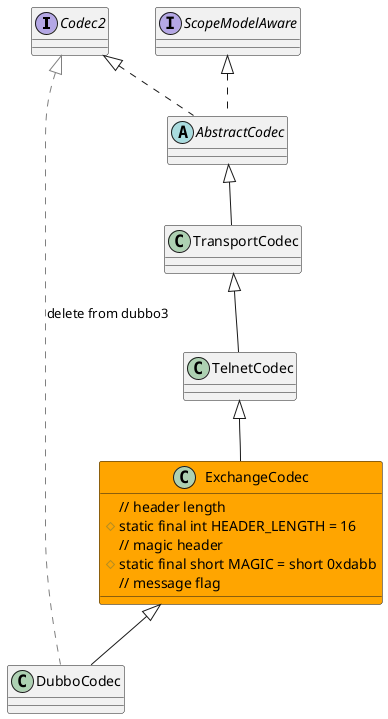

com.alibaba.dubbo.rpc.protocol.dubbo.DubboCodec
- 编解码

## hierarchy
```
AbstractCodec (com.alibaba.dubbo.remoting.transport)
    TransportCodec (com.alibaba.dubbo.remoting.transport.codec)
        TelnetCodec (com.alibaba.dubbo.remoting.telnet.codec)
            ExchangeCodec (com.alibaba.dubbo.remoting.exchange.codec)
                DubboCodec (com.alibaba.dubbo.rpc.protocol.dubbo)
DubboCodec (com.alibaba.dubbo.rpc.protocol.dubbo)
    ExchangeCodec (com.alibaba.dubbo.remoting.exchange.codec)
    Codec2 (com.alibaba.dubbo.remoting)
```

## define


