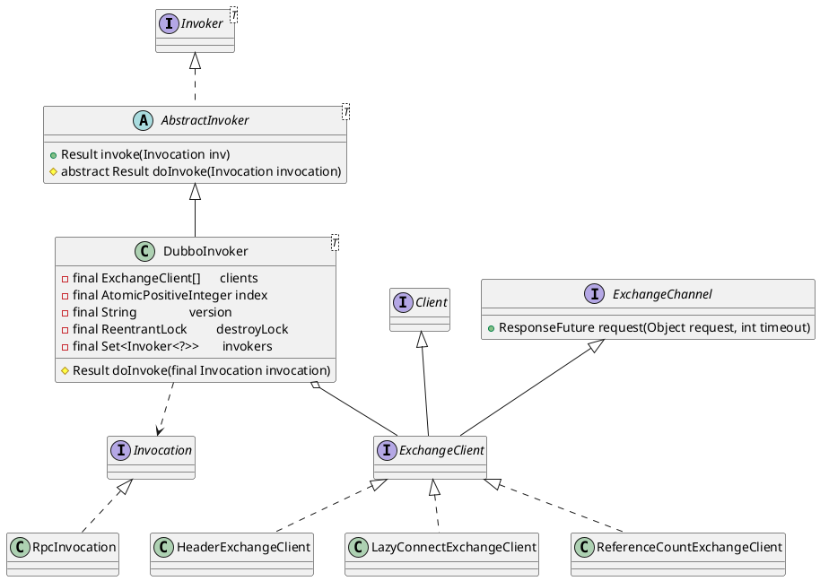

com.alibaba.dubbo.rpc.protocol.dubbo.DubboInvoker

* AtomicPositiveInteger 对AtomicInteger的包装
* ReentrantLock

## hierarchy
```
AbstractInvoker (com.alibaba.dubbo.rpc.protocol)
    ThriftInvoker (com.alibaba.dubbo.rpc.protocol.thrift)
    1 in RedisProtocol (com.alibaba.dubbo.rpc.protocol.redis)
    1 in MemcachedProtocol (com.alibaba.dubbo.rpc.protocol.memcached)
    2 in AbstractProxyProtocol (com.alibaba.dubbo.rpc.protocol)
    ChannelWrappedInvoker (com.alibaba.dubbo.rpc.protocol.dubbo)
    InjvmInvoker (com.alibaba.dubbo.rpc.protocol.injvm)
    DubboInvoker (com.alibaba.dubbo.rpc.protocol.dubbo)
```

## define
* doInvoke
  * isOneway 异步不带回调
  * isAsync 异步带回调
  * sync 同步



## fileds
```java
    private final ExchangeClient[] clients;

    private final AtomicPositiveInteger index = new AtomicPositiveInteger();

    private final String version;

    private final ReentrantLock destroyLock = new ReentrantLock();

    private final Set<Invoker<?>> invokers;
```

## methods

### doInvoke
- ExchangeClient extends Client, ExchangeChannel
  - [HeaderExchangeChannel](/docs/30-distributed/src/dubbo/remoting/exchange/support/header/HeaderExchangeChannel.md)
- [DefaultFuture](/docs/30-distributed/src/dubbo/remoting/exchange/support/DefaultFuture.md)


```java
    @Override
    protected Result doInvoke(final Invocation invocation) throws Throwable {
        RpcInvocation inv = (RpcInvocation) invocation;
        final String methodName = RpcUtils.getMethodName(invocation);
        inv.setAttachment(Constants.PATH_KEY, getUrl().getPath());
        inv.setAttachment(Constants.VERSION_KEY, version);

        ExchangeClient currentClient;
        if (clients.length == 1) {
            currentClient = clients[0];
        } else {
            currentClient = clients[index.getAndIncrement() % clients.length];
        }
        try {
            boolean isAsync = RpcUtils.isAsync(getUrl(), invocation);
            boolean isOneway = RpcUtils.isOneway(getUrl(), invocation);
            int timeout = getUrl().getMethodParameter(methodName, Constants.TIMEOUT_KEY, Constants.DEFAULT_TIMEOUT);
            if (isOneway) { // 异步无返回
                boolean isSent = getUrl().getMethodParameter(methodName, Constants.SENT_KEY, false);
                currentClient.send(inv, isSent);
                RpcContext.getContext().setFuture(null);
                return new RpcResult();
            } else if (isAsync) { // 异步有返回
                ResponseFuture future = currentClient.request(inv, timeout);
                RpcContext.getContext().setFuture(new FutureAdapter<Object>(future));
                return new RpcResult();
            } else { // 同步调用
                RpcContext.getContext().setFuture(null);
                return (Result) currentClient.request(inv, timeout).get();
            }
        } catch (TimeoutException e) {
            throw new RpcException(RpcException.TIMEOUT_EXCEPTION, "Invoke remote method timeout. method: " + invocation.getMethodName() + ", provider: " + getUrl() + ", cause: " + e.getMessage(), e);
        } catch (RemotingException e) {
            throw new RpcException(RpcException.NETWORK_EXCEPTION, "Failed to invoke remote method: " + invocation.getMethodName() + ", provider: " + getUrl() + ", cause: " + e.getMessage(), e);
        }
    }
```

### destroy
```java
    public void destroy() {
        //防止client被关闭多次.在connect per jvm的情况下，client.close方法会调用计数器-1，当计数器小于等于0的情况下，才真正关闭
        if (super.isDestroyed()) {
            return;
        } else {
            //dubbo check ,避免多次关闭
            destroyLock.lock();
            try {
                if (super.isDestroyed()) {
                    return;
                }
                super.destroy();
                if (invokers != null) {
                    invokers.remove(this);
                }
                for (ExchangeClient client : clients) {
                    try {
                        client.close(getShutdownTimeout());
                    } catch (Throwable t) {
                        logger.warn(t.getMessage(), t);
                    }
                }

            } finally {
                destroyLock.unlock();
            }
        }
    }

    protected static int getShutdownTimeout() {
        int timeout = Constants.DEFAULT_SERVER_SHUTDOWN_TIMEOUT;
        String value = ConfigUtils.getProperty(Constants.SHUTDOWN_WAIT_KEY);
        if (value != null && value.length() > 0) {
            try {
                timeout = Integer.parseInt(value);
            } catch (Exception e) {
            }
        } else {
            value = ConfigUtils.getProperty(Constants.SHUTDOWN_WAIT_SECONDS_KEY);
            if (value != null && value.length() > 0) {
                try {
                    timeout = Integer.parseInt(value) * 1000;
                } catch (Exception e) {
                }
            }
        }

        return timeout;
    }
```


## invoke
* ReferenceCountExchangeClient
* HeaderExchangeClient
* HeaderExchangeChannel