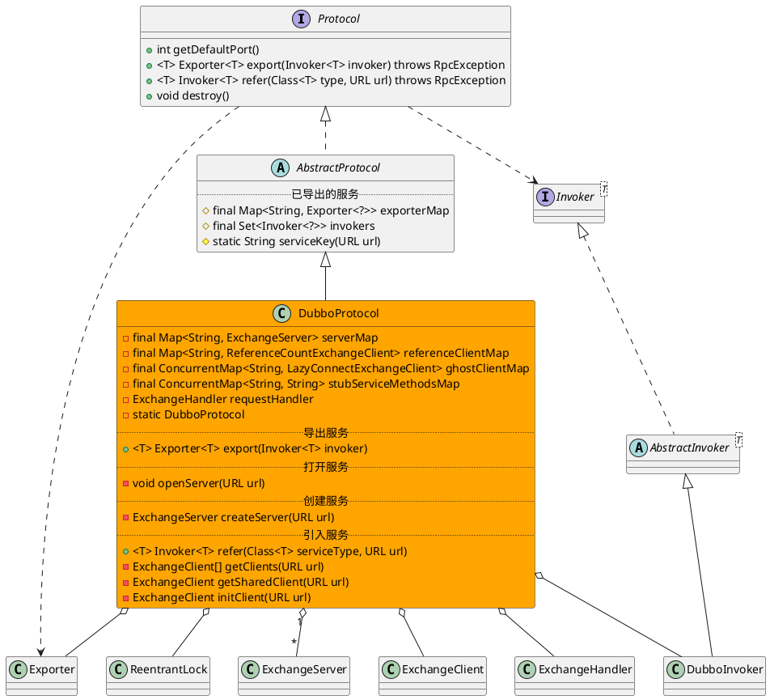

com.alibaba.dubbo.rpc.protocol.dubbo.DubboProtocol

* ReentrantLock
* ConcurrentHashMap
* ConcurrentHashSet

## hierarchy
```
AbstractProtocol (com.alibaba.dubbo.rpc.protocol)
    RedisProtocol (com.alibaba.dubbo.rpc.protocol.redis)
    InjvmProtocol (com.alibaba.dubbo.rpc.protocol.injvm)
    DubboProtocol (com.alibaba.dubbo.rpc.protocol.dubbo)
    ThriftProtocol (com.alibaba.dubbo.rpc.protocol.thrift)
    AbstractProxyProtocol (com.alibaba.dubbo.rpc.protocol)
    MemcachedProtocol (com.alibaba.dubbo.rpc.protocol.memcached)
    MockProtocol (com.alibaba.dubbo.rpc.support)
```

## define


## fields
```java
    private static DubboProtocol INSTANCE;
    public final ReentrantLock lock = new ReentrantLock();
    private final Map<String, ExchangeServer> serverMap = new ConcurrentHashMap<String, ExchangeServer>(); // <host:port,Exchanger>
    private final Map<String, ReferenceCountExchangeClient> referenceClientMap = new ConcurrentHashMap<String, ReferenceCountExchangeClient>(); // <host:port,Exchanger>
    private final ConcurrentMap<String, LazyConnectExchangeClient> ghostClientMap = new ConcurrentHashMap<String, LazyConnectExchangeClient>();
    //consumer side export a stub service for dispatching event
    //servicekey-stubmethods
    private final ConcurrentMap<String, String> stubServiceMethodsMap = new ConcurrentHashMap<String, String>();
```

## methods

### DubboProtocol
```java
    public DubboProtocol() {
        INSTANCE = this;
    }
```

### getInvoker
```java
    Invoker<?> getInvoker(Channel channel, Invocation inv) throws RemotingException {
        boolean isCallBackServiceInvoke = false;
        boolean isStubServiceInvoke = false;
        int port = channel.getLocalAddress().getPort();
        String path = inv.getAttachments().get(Constants.PATH_KEY);
        //如果是客户端的回调服务.
        isStubServiceInvoke = Boolean.TRUE.toString().equals(inv.getAttachments().get(Constants.STUB_EVENT_KEY));
        if (isStubServiceInvoke) {
            port = channel.getRemoteAddress().getPort();
        }
        //callback
        isCallBackServiceInvoke = isClientSide(channel) && !isStubServiceInvoke;
        if (isCallBackServiceInvoke) {
            path = inv.getAttachments().get(Constants.PATH_KEY) + "." + inv.getAttachments().get(Constants.CALLBACK_SERVICE_KEY);
            inv.getAttachments().put(IS_CALLBACK_SERVICE_INVOKE, Boolean.TRUE.toString());
        }
        String serviceKey = serviceKey(port, path, inv.getAttachments().get(Constants.VERSION_KEY), inv.getAttachments().get(Constants.GROUP_KEY));

        DubboExporter<?> exporter = (DubboExporter<?>) exporterMap.get(serviceKey);

        if (exporter == null)
            throw new RemotingException(channel, "Not found exported service: " + serviceKey + " in " + exporterMap.keySet() + ", may be version or group mismatch " + ", channel: consumer: " + channel.getRemoteAddress() + " --> provider: " + channel.getLocalAddress() + ", message:" + inv);

        return exporter.getInvoker();
    }
    
    private boolean isClientSide(Channel channel) {
        InetSocketAddress address = channel.getRemoteAddress();
        URL url = channel.getUrl();
        return url.getPort() == address.getPort() &&
                NetUtils.filterLocalHost(channel.getUrl().getIp())
                        .equals(NetUtils.filterLocalHost(address.getAddress().getHostAddress()));
    }
```

com.alibaba.dubbo.rpc.protocol.AbstractProtocol
```java
    protected static String serviceKey(int port, String serviceName, String serviceVersion, String serviceGroup) {
        return ProtocolUtils.serviceKey(port, serviceName, serviceVersion, serviceGroup);
    }
```


### export
```java
    public <T> Exporter<T> export(Invoker<T> invoker) throws RpcException {
        URL url = invoker.getUrl();

        // export service.
        String key = serviceKey(url);
        DubboExporter<T> exporter = new DubboExporter<T>(invoker, key, exporterMap);
        exporterMap.put(key, exporter);

        //export an stub service for dispaching event
        Boolean isStubSupportEvent = url.getParameter(Constants.STUB_EVENT_KEY, Constants.DEFAULT_STUB_EVENT);
        Boolean isCallbackservice = url.getParameter(Constants.IS_CALLBACK_SERVICE, false);
        if (isStubSupportEvent && !isCallbackservice) {
            String stubServiceMethods = url.getParameter(Constants.STUB_EVENT_METHODS_KEY);
            if (stubServiceMethods == null || stubServiceMethods.length() == 0) {
                if (logger.isWarnEnabled()) {
                    logger.warn(new IllegalStateException("consumer [" + url.getParameter(Constants.INTERFACE_KEY) +
                            "], has set stubproxy support event ,but no stub methods founded."));
                }
            } else {
                stubServiceMethodsMap.put(url.getServiceKey(), stubServiceMethods);
            }
        }

        openServer(url);

        return exporter;
    }
    
    private void openServer(URL url) {
        // find server.
        String key = url.getAddress();
        //client 也可以暴露一个只有server可以调用的服务。
        boolean isServer = url.getParameter(Constants.IS_SERVER_KEY, true);
        if (isServer) {
            ExchangeServer server = serverMap.get(key);
            if (server == null) {
                serverMap.put(key, createServer(url));
            } else {
                //server支持reset,配合override功能使用
                server.reset(url);
            }
        }
    }
    
    private ExchangeServer createServer(URL url) {
        //默认开启server关闭时发送readonly事件
        url = url.addParameterIfAbsent(Constants.CHANNEL_READONLYEVENT_SENT_KEY, Boolean.TRUE.toString());
        //默认开启heartbeat
        url = url.addParameterIfAbsent(Constants.HEARTBEAT_KEY, String.valueOf(Constants.DEFAULT_HEARTBEAT));
        String str = url.getParameter(Constants.SERVER_KEY, Constants.DEFAULT_REMOTING_SERVER);

        if (str != null && str.length() > 0 && !ExtensionLoader.getExtensionLoader(Transporter.class).hasExtension(str))
            throw new RpcException("Unsupported server type: " + str + ", url: " + url);

        url = url.addParameter(Constants.CODEC_KEY, Version.isCompatibleVersion() ? COMPATIBLE_CODEC_NAME : DubboCodec.NAME);
        ExchangeServer server;
        try {
            server = Exchangers.bind(url, requestHandler);
        } catch (RemotingException e) {
            throw new RpcException("Fail to start server(url: " + url + ") " + e.getMessage(), e);
        }
        str = url.getParameter(Constants.CLIENT_KEY);
        if (str != null && str.length() > 0) {
            Set<String> supportedTypes = ExtensionLoader.getExtensionLoader(Transporter.class).getSupportedExtensions();
            if (!supportedTypes.contains(str)) {
                throw new RpcException("Unsupported client type: " + str);
            }
        }
        return server;
    }    
```

ExchangeServer.bind
```java
    public static ExchangeServer bind(URL url, ExchangeHandler handler) throws RemotingException {
        if (url == null) {
            throw new IllegalArgumentException("url == null");
        }
        if (handler == null) {
            throw new IllegalArgumentException("handler == null");
        }
        url = url.addParameterIfAbsent(Constants.CODEC_KEY, "exchange");
        return getExchanger(url).bind(url, handler);
    }
    
    
    public static Exchanger getExchanger(URL url) {
        String type = url.getParameter(Constants.EXCHANGER_KEY, Constants.DEFAULT_EXCHANGER);
        return getExchanger(type);
    }

    public static Exchanger getExchanger(String type) {
        return ExtensionLoader.getExtensionLoader(Exchanger.class).getExtension(type);
    }
```


HeaderExchanger
```java
public class HeaderExchanger implements Exchanger {

    public static final String NAME = "header";

    public ExchangeClient connect(URL url, ExchangeHandler handler) throws RemotingException {
        return new HeaderExchangeClient(Transporters.connect(url, new DecodeHandler(new HeaderExchangeHandler(handler))));
    }

    public ExchangeServer bind(URL url, ExchangeHandler handler) throws RemotingException {
        return new HeaderExchangeServer(Transporters.bind(url, new DecodeHandler(new HeaderExchangeHandler(handler))));
    }

}
```

### refer
```java
    public <T> Invoker<T> refer(Class<T> serviceType, URL url) throws RpcException {
        // create rpc invoker.
        DubboInvoker<T> invoker = new DubboInvoker<T>(serviceType, url, getClients(url), invokers);
        invokers.add(invoker);
        return invoker;
    }
```


### destroy
```java
    public void destroy() {
        for (String key : new ArrayList<String>(serverMap.keySet())) {
            ExchangeServer server = serverMap.remove(key);
            if (server != null) {
                try {
                    if (logger.isInfoEnabled()) {
                        logger.info("Close dubbo server: " + server.getLocalAddress());
                    }
                    server.close(getServerShutdownTimeout());
                } catch (Throwable t) {
                    logger.warn(t.getMessage(), t);
                }
            }
        }

        for (String key : new ArrayList<String>(referenceClientMap.keySet())) {
            ExchangeClient client = referenceClientMap.remove(key);
            if (client != null) {
                try {
                    if (logger.isInfoEnabled()) {
                        logger.info("Close dubbo connect: " + client.getLocalAddress() + "-->" + client.getRemoteAddress());
                    }
                    client.close(getServerShutdownTimeout());
                } catch (Throwable t) {
                    logger.warn(t.getMessage(), t);
                }
            }
        }

        for (String key : new ArrayList<String>(ghostClientMap.keySet())) {
            ExchangeClient client = ghostClientMap.remove(key);
            if (client != null) {
                try {
                    if (logger.isInfoEnabled()) {
                        logger.info("Close dubbo connect: " + client.getLocalAddress() + "-->" + client.getRemoteAddress());
                    }
                    client.close(getServerShutdownTimeout());
                } catch (Throwable t) {
                    logger.warn(t.getMessage(), t);
                }
            }
        }
        stubServiceMethodsMap.clear();
        super.destroy();
    }
```

