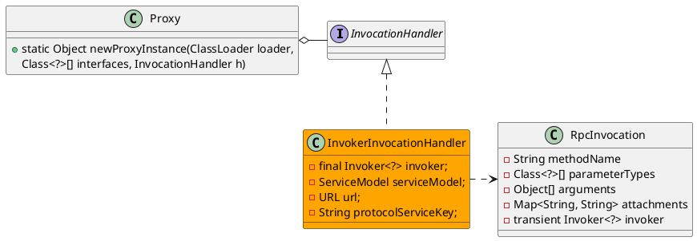
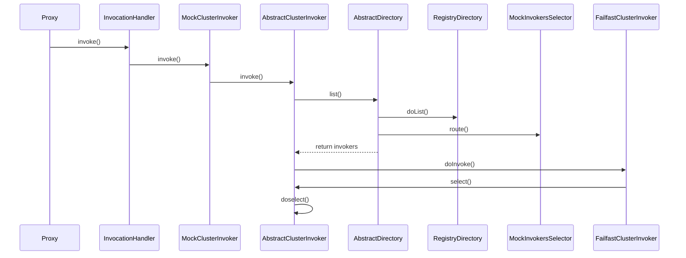

com.alibaba.dubbo.rpc.proxy.InvokerInvocationHandler

## define

```plantuml
@startuml

interface InvocationHandler
InvocationHandler ^.. InvokerInvocationHandler

class InvokerInvocationHandler #orange {
    - final Invoker<?> invoker;
    - ServiceModel serviceModel;
    - URL url;
    - String protocolServiceKey;
}

InvokerInvocationHandler .> RpcInvocation

class RpcInvocation {
    - String methodName
    - Class<?>[] parameterTypes
    - Object[] arguments
    - Map<String, String> attachments
    - transient Invoker<?> invoker
}

class Proxy {
  + static Object newProxyInstance(ClassLoader loader, 
          Class<?>[] interfaces, InvocationHandler h)
}
Proxy o- InvocationHandler

@enduml
```
## invoke

```mermaid
sequenceDiagram

Proxy ->> InvocationHandler: invoke()
InvocationHandler ->> MockClusterInvoker: invoke()
MockClusterInvoker ->> AbstractClusterInvoker: invoke()

AbstractClusterInvoker ->> AbstractDirectory: list()
AbstractDirectory ->> RegistryDirectory: doList()
AbstractDirectory ->> MockInvokersSelector: route()
AbstractDirectory -->> AbstractClusterInvoker: return invokers

AbstractClusterInvoker ->> FailfastClusterInvoker: doInvoke()
FailfastClusterInvoker ->> AbstractClusterInvoker: select()
AbstractClusterInvoker ->> AbstractClusterInvoker: doselect()

```