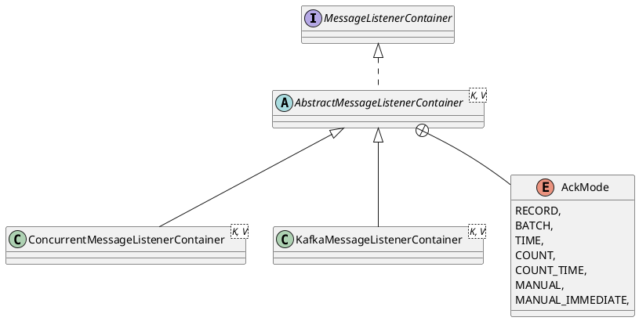

org.springframework.kafka.listener.MessageListenerContainer

## hierarchy
```
MessageListenerContainer (org.springframework.kafka.listener)
    AbstractMessageListenerContainer (org.springframework.kafka.listener)
        ConcurrentMessageListenerContainer (org.springframework.kafka.listener)
        KafkaMessageListenerContainer (org.springframework.kafka.listener)
MessageListenerContainer (org.springframework.kafka.listener)
    SmartLifecycle (org.springframework.context)
        Lifecycle (org.springframework.context)
        Phased (org.springframework.context)
```

## define


```java
public interface MessageListenerContainer extends SmartLifecycle {
	void setupMessageListener(Object messageListener);
}
```