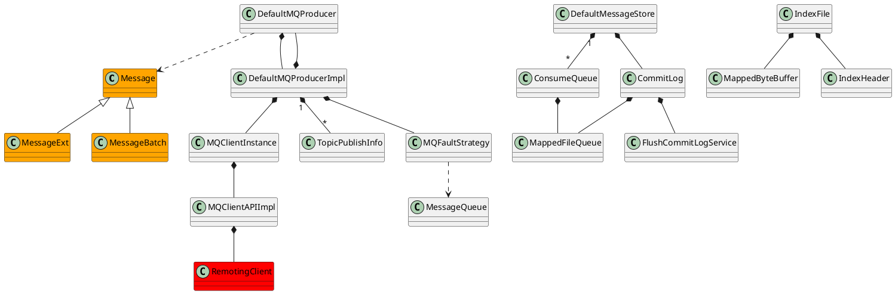

# rocketmq

## rocketmq package
RocketMQ共包含9个模块
* rocketmq-common：通用的枚举、基类方法、或者数据结构，包名有admin、consumer、filter、hook、message
* rocketmq-remoting：使用netty的客户端、服务端，使用fastjson序列化，自定义二进制协议
* rocketmq-srvutil：只有一个ServerUtil类，只提供Server程序依赖，尽可能减少客户端依赖
* rocketmq-store：消息存储，索引，consumerLog，commitLog等
* rocketmq-client：消息发送和接收，包含consumer和producer
* rocketmq-filtersrv：消息过滤器
* rocketmq-broker：服务端，接受消息，存储消息，consumer拉取消息
* rocketmq-tools：命令行工具
* rocketmq-namesrv：NameServer，类似服务注册中心，broker在这里注册，consumer和producer在这里找到broker地址

## rocketmq 4.3.0

### common
* common
  * message
    * [Message](/docs/30-distributed/src/mq/rocketmq/rocketmq-common/message/Message.md)
  * [TopicConfig](/docs/30-distributed/src/mq/rocketmq/rocketmq-common/TopicConfig.md)
  
### broker  
* [broker](/docs/30-distributed/src/mq/rocketmq/rocketmq-broker/README.md)
  * latency
  * longpolling
    * [PullRequestHoldService](/docs/30-distributed/src/mq/rocketmq/rocketmq-broker/longpolling/PullRequestHoldService.md)
  * offset
    * [ConsumerOffsetManager](/docs/30-distributed/src/mq/rocketmq/rocketmq-broker/offset/ConsumerOffsetManager.md)
  * out
    * [BrokerOuterAPI](/docs/30-distributed/src/mq/rocketmq/rocketmq-broker/out/BrokerOuterAPI.md)
  * pagecache
  * processor
    * [QueryMessageProcessor](/docs/30-distributed/src/mq/rocketmq/rocketmq-broker/processor/QueryMessageProcessor.md)
    * [SendMessageProcessor](/docs/30-distributed/src/mq/rocketmq/rocketmq-broker/processor/SendMessageProcessor.md)
  * slave
    * [SlaveSynchronize](/docs/30-distributed/src/mq/rocketmq/rocketmq-broker/slave/SlaveSynchronize.md)
  * transaction
    * [`TransactionalMessageCheckService`](/docs/30-distributed/src/mq/rocketmq/rocketmq-broker/transaction/TransactionalMessageCheckService.md)
    * [TransactionalMessageService](/docs/30-distributed/src/mq/rocketmq/rocketmq-broker/transaction/TransactionalMessageService.md)
  * [BrokerController](/docs/30-distributed/src/mq/rocketmq/rocketmq-broker/BrokerController.md)

### client  
* [client](/docs/30-distributed/src/mq/rocketmq/rocketmq-client/README.md)
  * consumer
    * [DefaultMQPushConsumer](/docs/30-distributed/src/mq/rocketmq/rocketmq-client/consumer/DefaultMQPushConsumer.md) 
    * [AllocateMessageQueueStrategy](/docs/30-distributed/src/mq/rocketmq/rocketmq-client/consumer/AllocateMessageQueueStrategy.md) 负载均衡
  * impl
    * consumer
      * [DefaultMQPushConsumerImpl](/docs/30-distributed/src/mq/rocketmq/rocketmq-client/impl/consumer/DefaultMQPushConsumerImpl.md)
      * [`PullMessageService`](/docs/30-distributed/src/mq/rocketmq/rocketmq-client/impl/consumer/PullMessageService.md) 拉取消息服务
      * [`ProcessQueue`](/docs/30-distributed/src/mq/rocketmq/rocketmq-client/impl/consumer/ProcessQueue.md)
      * [`ConsumeMessageService`](docs/30-distributed/src/rocketmq/rocketmq-client/impl/consumer/ConsumeMessageService.md/)
      * [ConsumeMessageOrderlyService](/docs/30-distributed/src/mq/rocketmq/rocketmq-client/impl/consumer/ConsumeMessageOrderlyService.md) 顺序消费（队列加锁消费）
      * [ConsumeMessageConcurrentlyService](/docs/30-distributed/src/mq/rocketmq/rocketmq-client/impl/consumer/ConsumeMessageConcurrentlyService.md) 并发消费
      * [`RebalanceService`](/docs/30-distributed/src/mq/rocketmq/rocketmq-client/impl/consumer/RebalanceService.md) 消费端再平衡服务
      * [RebalanceImpl](/docs/30-distributed/src/mq/rocketmq/rocketmq-client/impl/consumer/RebalanceImpl.md)
    * producer
      * [DefaultMQProducerImpl](/docs/30-distributed/src/mq/rocketmq/rocketmq-client/impl/producer/DefaultMQProducerImpl.md)
      * MQProducerInner
      * [TopicPublishInfo](/docs/30-distributed/src/mq/rocketmq/rocketmq-client/impl/producer/TopicPublishInfo.md)
    * factory
      * [MQClientInstance](/docs/30-distributed/src/mq/rocketmq/rocketmq-client/impl/factory/MQClientInstance.md)
    * [MQClientManager](/docs/30-distributed/src/mq/rocketmq/rocketmq-client/impl/MQClientManager.md)
  * producer
    * [DefaultMQProducer](/docs/30-distributed/src/mq/rocketmq/rocketmq-client/producer/DefaultMQProducer.md)
    * [`TransactionMQProducer`](/docs/30-distributed/src/mq/rocketmq/rocketmq-client/producer/TransactionMQProducer.md)

### filter
* [filter](/docs/30-distributed/src/mq/rocketmq/rocketmq-filter/README.md) 管道过滤器

### logging
* logging 日志适配

### namesrc
* [namesrv](/docs/30-distributed/src/mq/rocketmq/rocketmq-namesrv/README.md) 命名服务
  * routeinfo
    * [RouteInfoManager](/docs/30-distributed/src/mq/rocketmq/rocketmq-namesrv/routeinfo/RouteInfoManager.md)

### openmessaging
* openmessaging

### remoting
* [remoting](/docs/30-distributed/src/mq/rocketmq/rocketmq-remoting/README.md) 远程通信
  * netty
    * [NettyRemotingServer](/docs/30-distributed/src/mq/rocketmq/rocketmq-remoting/netty/NettyRemotingServer.md)
    * [NettyRemotingClient](/docs/30-distributed/src/mq/rocketmq/rocketmq-remoting/netty/NettyRemotingClient.md)
  * [RemotingService](/docs/30-distributed/src/mq/rocketmq/rocketmq-remoting/RemotingService.md)

### servutil
* [srvutil](/docs/30-distributed/src/mq/rocketmq/rocketmq-srvutil/README.md)

### store
* [store](/docs/30-distributed/src/mq/rocketmq/rocketmq-store/README.md) 存储
  * [config](/docs/30-distributed/src/mq/rocketmq/rocketmq-store/config/README.md)
    * [MessageStoreConfig](/docs/30-distributed/src/mq/rocketmq/rocketmq-store/config/MessageStoreConfig.md)
  * ha
    * [HAService](/docs/30-distributed/src/mq/rocketmq/rocketmq-store/ha/HAService.md)
    * [WaitNotifyObject](/docs/30-distributed/src/mq/rocketmq/rocketmq-store/ha/WaitNotifyObject.md)
  * index
    * [`IndexFile`](/docs/30-distributed/src/mq/rocketmq/rocketmq-store/index/IndexFile.md)
    * [`IndexHeader`](/docs/30-distributed/src/mq/rocketmq/rocketmq-store/index/IndexHeader.md)
    * [`IndexService`](/docs/30-distributed/src/mq/rocketmq/rocketmq-store/index/IndexService.md)
  * schedule
    * [ScheduleMessageService](/docs/30-distributed/src/mq/rocketmq/rocketmq-store/schedule/ScheduleMessageService.md)
  * [CommitLog](/docs/30-distributed/src/mq/rocketmq/rocketmq-store/CommitLog.md)
  * [ConsumeQueue](/docs/30-distributed/src/mq/rocketmq/rocketmq-store/ConsumeQueue.md)
  * [MappedFile](/docs/30-distributed/src/mq/rocketmq/rocketmq-store/MappedFile.md)
  * [MappedFileQueue](/docs/30-distributed/src/mq/rocketmq/rocketmq-store/MappedFileQueue.md)
  * [`DefaultMessageStore`](/docs/30-distributed/src/mq/rocketmq/rocketmq-store/DefaultMessageStore.md) 顺序写
    - ReputMessageService 准实时地将消息转发给ConsumeQueue与Hash索引文件

### tools
* [tools](/docs/30-distributed/src/mq/rocketmq/rocketmq-tools/README.md)

## rocketmq-client 3.5.8
* [rocketmq-client](/docs/30-distributed/src/mq/rocketmq/rocketmq-client3/README.md)

<!-- 
## jars
* Maven: org.apache.rocketmq:rocketmq-broker:4.3.0
* Maven: org.apache.rocketmq:rocketmq-client:4.3.0
* Maven: org.apache.rocketmq:rocketmq-common:4.3.0
* Maven: org.apache.rocketmq:rocketmq-filter:4.3.0
* Maven: org.apache.rocketmq:rocketmq-logging:4.3.0
* Maven: org.apache.rocketmq:rocketmq-namesrv:4.3.0
* Maven: org.apache.rocketmq:rocketmq-openmessaging:4.3.0
* Maven: org.apache.rocketmq:rocketmq-remoting:4.3.0
* Maven: org.apache.rocketmq:rocketmq-srvutil:4.3.0
* Maven: org.apache.rocketmq:rocketmq-store:4.3.0
* Maven: org.apache.rocketmq:rocketmq-tools:4.3.0
-->

## overview

## links
- [《RocketMQ实战与原理解析》杨开元](/99-book/notes/30-distributed/RocketMQ实战与原理解析.md)
- [RocketMQ详解](https://zhuanlan.zhihu.com/rocketmq)